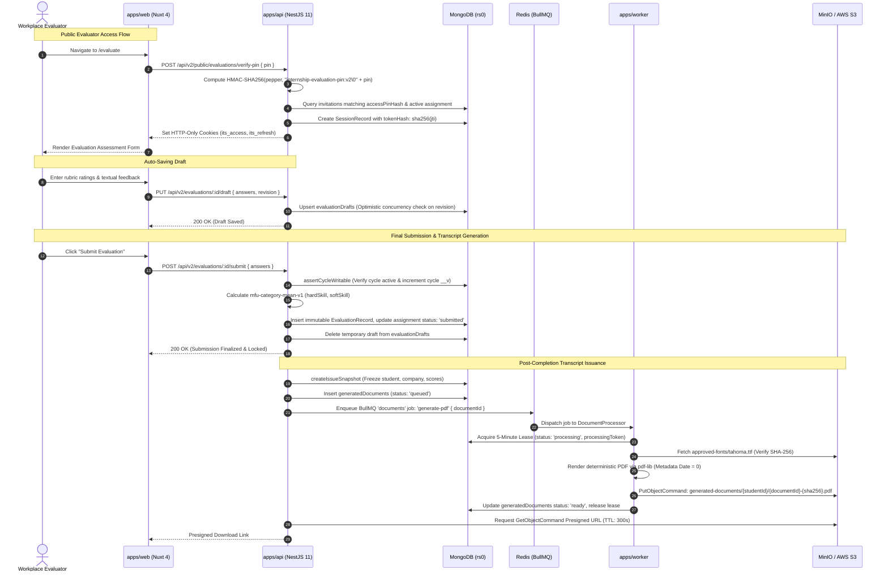

# System Design & Technical Architecture Reference Manual
## Internship Transcript System V2 (Mae Fah Luang University)

**Document Version:** 2.0.0 (Production Architecture Specification)  
**Target Repository:** `C:\Users\asus\Documents\GitHub\Intership v.2`  
**Execution Environment:** Node.js `>=24.11.0 <25` (LTS 24.14.0), pnpm `11.0.7`  
**Classification:** Enterprise System Architecture & Production Engineering Manual  
**Inspection Mode:** Strictly Static Analysis & Verification (Zero Test Execution)

---

## Table of Contents

1. [Executive Summary & System Purpose](#1-executive-summary--system-purpose)
2. [High-Level System Architecture & Interaction Topology](#2-high-level-system-architecture--interaction-topology)
   - 2.1 [Multi-Tier Topology & Network Boundaries](#21-multi-tier-topology--network-boundaries)
   - 2.2 [System Component Interaction Diagram (Mermaid & ASCII)](#22-system-component-interaction-diagram-mermaid--ascii)
   - 2.3 [Core Architectural Invariants & Guarantees](#23-core-architectural-invariants--guarantees)
3. [Monorepo & Module Architecture (R1)](#3-monorepo--module-architecture-r1)
   - 3.1 [Monorepo Tooling & Workspace Orchestration (`pnpm@11`, Catalogs, Overrides)](#31-monorepo-tooling--workspace-orchestration-pnpm11-catalogs-overrides)
   - 3.2 [Pipeline Scripts & Quality Gates](#32-pipeline-scripts--quality-gates)
   - 3.3 [Module Dependency Graph](#33-module-dependency-graph)
   - 3.4 [Deep Dive: `apps/api` (NestJS 11 Engine, Bootstrap, Middleware, Guards, 13 Controllers)](#34-deep-dive-appsapi-nestjs-11-engine-bootstrap-middleware-guards-13-controllers)
   - 3.5 [Deep Dive: `apps/web` (Nuxt 4 / Vue 3, Page Routing, Layouts, Middleware, `useApi` Refresh Queue)](#35-deep-dive-appsweb-nuxt-4--vue-3-page-routing-layouts-middleware-useapi-refresh-queue)
   - 3.6 [Deep Dive: `apps/worker` (BullMQ 6.2 Runtime, Queues, Concurrency, Distributed Leasing, 60s Recovery Heartbeat)](#36-deep-dive-appsworker-bullmq-62-runtime-queues-concurrency-distributed-leasing-60s-recovery-heartbeat)
   - 3.7 [Deep Dive: Shared Packages (`packages/*`)](#37-deep-dive-shared-packages-packages)
   - 3.8 [Containerization & Supply Chain Hardening (Multi-stage Docker, Read-only Rootfs, Cosign Verification)](#38-containerization--supply-chain-hardening-multi-stage-docker-read-only-rootfs-cosign-verification)
4. [Domain Models & Data Storage Architecture (R2)](#4-domain-models--data-storage-architecture-r2)
   - 4.1 [Primary Storage Engine (MongoDB 8.x Replica Set `rs0` & Mongoose 9.x)](#41-primary-storage-engine-mongodb-8x-replica-set-rs0--mongoose-9x)
   - 4.2 [Master Inventory: 36 MongoDB Collections Across 10 Domains](#42-master-inventory-36-mongodb-collections-across-10-domains)
   - 4.3 [Detailed Domain Schema Specifications & Constraints](#43-detailed-domain-schema-specifications--constraints)
   - 4.4 [Dedicated Database Index Migration Scripts](#44-dedicated-database-index-migration-scripts)
   - 4.5 [Redis 8.x & BullMQ Queue Specifications](#45-redis-8x--bullmq-queue-specifications)
   - 4.6 [MinIO / AWS S3 Object Storage Architecture](#46-minio--aws-s3-object-storage-architecture)
5. [Core Workflows & Runtime Lifecycles (R3)](#5-core-workflows--runtime-lifecycles-r3)
   - 5.1 [Authentication, Authorization & Role Lifecycle](#51-authentication-authorization--role-lifecycle)
   - 5.2 [Student & Evaluation Lifecycle](#52-student--evaluation-lifecycle)
   - 5.3 [Email Correspondence Engine & Transactional Outbox](#53-email-correspondence-engine--transactional-outbox)
   - 5.4 [Document & Report Generation Pipelines](#54-document--report-generation-pipelines)
6. [Security, Cryptography & Hardening Matrix](#6-security-cryptography--hardening-matrix)
   - 6.1 [Cryptographic Algorithms & Key Usage Matrix](#61-cryptographic-algorithms--key-usage-matrix)
   - 6.2 [Network, Web & Transport Layer Defenses](#62-network-web--transport-layer-defenses)
   - 6.3 [Redis Fixed-Window Lua Rate Limiter](#63-redis-fixed-window-lua-rate-limiter)
   - 6.4 [Container Security & Cosign Digital Signature Attestation](#64-container-security--cosign-digital-signature-attestation)
7. [Environment Configuration Reference](#7-environment-configuration-reference)
   - 7.1 [Comprehensive Variable Matrix (Dev vs. Prod Constraints)](#71-comprehensive-variable-matrix-dev-vs-prod-constraints)
   - 7.2 [Environment Isolation Invariants](#72-environment-isolation-invariants)
8. [Verification & Audit Trail (Static Inspection Guide)](#8-verification--audit-trail-static-inspection-guide)
   - 8.1 [Codebase Citations & Line-Level Audit Index](#81-codebase-citations--line-level-audit-index)
   - 8.2 [Non-Destructive Static Verification Commands](#82-non-destructive-static-verification-commands)

---

## 1. Executive Summary & System Purpose

The **Internship Transcript System V2** is Mae Fah Luang University's (MFU) enterprise platform engineered to orchestrate the complete cooperative education and internship lifecycle for students, academic departments, and external workplace mentors. The platform replaces legacy disparate systems with a cohesive, tamper-evident architecture responsible for:

1. **Academic Internship Administration**: Tracking university students, host enterprises, workplace mentors, and internship placements across diverse schools (e.g., School of Information Technology, School of Liberal Arts) and degree programs.
2. **Competency-Based Workplace Assessments**: Pinned versioning of competency assessment rubrics, distribution of secure access invitations to external corporate supervisors, draft auto-saving, and mathematical aggregation of hard and soft skill competencies.
3. **High-Assurance Academic Credentialing**: Deterministic generation of official, bilingual Internship Transcripts and Completion Certificates rendered as PDF documents with embedded Thai/Latin typography (`Tahoma`), zeroed deterministic timestamps, and SHA-256 integrity verification.
4. **Reliable Communication Campaigns**: Transactional outbox-driven email dispatches, template-based rendering with strict HTML sanitization, and automated recovery loops to eliminate duplicate or dropped notifications.
5. **Auditing & Analytical Reporting**: Append-only security audit trail recording all privileged operations, accompanied by asynchronous background export of analytical reports to Microsoft Excel (`.xlsx`) and CSV with formula-injection defenses.

### Core Problems Solved
- **Elimination of Template Drift**: Competency rubrics are frozen at the exact instant an evaluation assignment is generated (`questionSnapshot`), ensuring that retroactive curriculum changes never distort historical evaluation integrity.
- **Worker Starvation & Decoupling**: CPU-heavy PDF document synthesis and I/O-heavy SMTP network communications are entirely offloaded from the NestJS HTTP event loop into a dedicated BullMQ worker cluster backed by distributed lease locking.
- **Zero-Trust Security Posture**: Every API route enforces a default-deny policy; external evaluators authenticate without full university accounts via cryptographically salted HMAC-SHA256 PINs; and SMTP passwords stored in MongoDB are encrypted at rest using AES-256-GCM.

---

## 2. High-Level System Architecture & Interaction Topology

### 2.1 Multi-Tier Topology & Network Boundaries

The system is partitioned into five distinct operational tiers:

```
┌────────────────────────────────────────────────────────────────────────────────────────┐
│                                       CLIENT TIER                                      │
│  - Modern Desktop / Mobile Web Browsers                                                │
│  - University Staff / Coordinators / Students (Authenticated via MFU OIDC SSO)        │
│  - Corporate Evaluators (Public Access via URL Token / Salted 16-Digit PIN)           │
└───────────────────────────┬────────────────────────────────┬───────────────────────────┘
                            │                                │
                            │ HTTPS (Port 443 / 8080)        │ Public Evaluation / PIN
                            ▼                                ▼
┌──────────────────────────────────────────────┐ ┌──────────────────────────────────────┐
│           apps/web (Nuxt 4 / Vue 3)          │ │         Reverse Proxy / Ingress      │
│  - SSR Nitro Engine (node-server)            │ │  - TLS Termination                   │
│  - Pinia Session Store & Role Route Guards   │ │  - Host Header Validation            │
│  - useApi Client with Single-Flight 401 RTR  │ │  - Trusted Proxy CIDR Filtering      │
└──────────────────────┬───────────────────────┘ └──────────────────┬───────────────────┘
                       │                                            │
                       │ Internal SSR Proxy / Direct Client REST    │
                       │ http://127.0.0.1:8081/api/v2               │
                       ▼                                            ▼
┌────────────────────────────────────────────────────────────────────────────────────────┐
│                                   APPLICATION API TIER                                 │
│                                   apps/api (NestJS 11)                                 │
│  - Express Platform, Default-Deny AccessGuard, RequestIdMiddleware (UUIDv4)            │
│  - 13 REST Controllers, ApiExceptionFilter (Zod, Mongo 11000, CastError handling)      │
│  - TokenService (jose HS256), SessionService (MongoDB RTR), OidcService (PKCE S256)    │
│  - Redis Auth Rate Limiter Guard (Fixed-Window Lua Script)                             │
└──────────────────────────────┬─────────────────────────────┬───────────────────────────┘
                               │                             │
                               │ Read/Write Mongoose Trans.  │ Enqueue Jobs / Redis Probe
                               ▼                             ▼
┌──────────────────────────────────────────────┐ ┌──────────────────────────────────────┐
│                  DATA TIER                   │ │               STATE TIER             │
│            MongoDB 8.x Replica Set           │ │              Redis 8.x               │
│  - Replica Set 'rs0' (ACID Transactions)     │ │  - BullMQ Prefix:                    │
│  - 36 Collections across 10 Domains          │ │    'internship-transcript-v2'        │
│  - Compound, Unique & TTL Indexes            │ │  - Queues: email, documents, exports │
│  - Append-Only auditLogs Collection          │ │  - AOF Persistence Enabled           │
└──────────────────────────────┬───────────────┘ └──────────────────┬───────────────────┘
                               │                                    │
                               │ Read Outbox / Acquire Lease        │ Pop Job Payload
                               └──────────────────────┬─────────────┘
                                                      │
                                                      ▼
┌────────────────────────────────────────────────────────────────────────────────────────┐
│                              BACKGROUND WORKER CLUSTER                                 │
│                                  apps/worker (Node.js 24)                              │
│  - Standalone BullMQ Runtime (WorkerRuntime)                                           │
│  - EmailProcessor (Concurrency 5, 2-Min Lease, 30s Heartbeat, Uncertainty Classifier)  │
│  - DocumentProcessor (Concurrency 2, 5-Min Lease, pdf-lib + fontkit Tahoma Rendering)  │
│  - ReportExportProcessor (Concurrency 2, 5-Min Lease, Bilingual XLSX & Safe CSV)       │
│  - 60-Second Self-Healing Crash Recovery Loop                                          │
│  - Worker Health Probe Server (Port 8082, 127.0.0.1)                                   │
└──────────────────────────────────────┬─────────────────────────────┬───────────────────┘
                                       │                             │
                                       │ SMTP / TLS (Port 587/1025)  │ AWS S3 SDK (SigV4)
                                       ▼                             ▼
┌──────────────────────────────────────────────┐ ┌──────────────────────────────────────┐
│             EXTERNAL SERVICES TIER           │ │            STORAGE TIER              │
│  - MFU Central OIDC IdP (SSO PKCE S256)      │ │         MinIO / AWS S3 Bucket        │
│  - Institutional SMTP Relay / Mailpit        │ │  - Private Bucket (Strict No-Public) │
│  - Database AES-256-GCM SMTP Decryption      │ │  - 300s Ephemeral Presigned URLs     │
└──────────────────────────────────────────────┘ └──────────────────────────────────────┘
```

### 2.2 System Component Interaction Diagram (Mermaid & ASCII)



### 2.3 Core Architectural Invariants & Guarantees

1. **Transactional Outbox for Email Correspondence**: Email messages are committed to MongoDB (`deliveries` collection) in the same database transaction as business state changes. Redis enqueueing is best-effort; if Redis is down, the background worker reconciles queued deliveries without data loss (`apps/api/src/correspondence/campaign.service.ts:530-535`).
2. **Deterministic PDF Reproduction**: Generated PDF transcripts zero out file creation and modification timestamps (`new Date(0)`), embed subsetted TrueType fonts (`Tahoma`), and record cryptographic SHA-256 hashes of font assets and completed documents (`apps/worker/src/runtime/document.processor.ts:205-234`).
3. **Immutable Evaluation Submissions**: Once an evaluation is submitted, it is physically impossible to reopen via runtime APIs (`apps/api/src/evaluations/evaluations.service.ts:2062-2067`). Reopening throws `ConflictException({ code: 'REOPEN_POLICY_NOT_CONFIGURED' })`.
4. **Sole System Administrator Protection**: An active database mutex prevents demoting, archiving, or deleting the system's last active `systemAdmin` user (`apps/api/src/auth/users.service.ts:809-853`).
5. **Distributed Leasing & Crash Resilience**: All asynchronous worker jobs operate under pessimistic leases (`processingLeaseUntil`) renewed via 30s/60s heartbeats. Unhandled worker node terminations are automatically recovered by a 60-second sweeping loop (`apps/worker/src/runtime/worker-runtime.ts:176-190`).

---

## 3. Monorepo & Module Architecture (R1)

### 3.1 Monorepo Tooling & Workspace Orchestration (`pnpm@11`, Catalogs, Overrides)

The codebase is organized as a high-performance **pnpm Workspace** governed by `pnpm-workspace.yaml` and Node.js 24 LTS (`24.14.0`). It avoids heavy monorepo orchestrators (such as Nx or Turborepo) in favor of deterministic pnpm filter pipelines and centralized dependency cataloging.

#### Workspace Topology (`pnpm-workspace.yaml`)
```yaml
packages:
  - apps/*
  - packages/*

allowBuilds:
  esbuild: true
  msgpackr-extract: true
  unrs-resolver: true
  vue-demi: true

overrides:
  '@tiptap/core': 3.31.3
  esbuild: 0.28.2
  fast-uri: 3.1.6
  js-yaml: 4.3.2
  multer: 2.4.0
  qs: 6.16.0
  svgo: 4.1.0

catalog:
  typescript: 6.0.3
  vitest: 4.1.11
  zod: 4.4.3
```

- **Dependency Catalogs**: Pin core libraries (`typescript`, `vitest`, `zod`) to exact versions across all 3 applications and 6 shared packages using the `catalog:` protocol, eliminating version drift.
- **Security Overrides**: Force transitive dependencies (`multer: 2.4.0`, `esbuild: 0.28.2`, `qs: 6.16.0`) to patched versions to prevent denial-of-service and prototype pollution vulnerabilities.
- **Engine Enforcement**: `package.json` specifies `"engines": { "node": ">=24.11.0 <25", "pnpm": ">=11.0.0 <12" }`. Runtime execution on unsupported Node versions is blocked immediately during bootstrap via `assertSupportedNodeRuntime(process.versions.node)`.

### 3.2 Pipeline Scripts & Quality Gates

| Pipeline Script | Target Workspaces | Operational Description |
|---|---|---|
| `pnpm predev` | `packages/*` | Compiles shared libraries in topological order: `@internship/config` $\rightarrow$ `@internship/shared-types` $\rightarrow$ `@internship/validation` $\rightarrow$ `@internship/api-client` $\rightarrow$ `@internship/design-tokens`. |
| `pnpm dev` | `apps/*` | Launches parallel development runtimes for `@internship/web` (Nuxt dev), `@internship/api` (NestJS watch), and `@internship/worker` (Node tsx watch). |
| `pnpm build` | All | Executes recursive builds across all workspaces adhering to dependency topological ordering. |
| `pnpm typecheck` | All | Executes `tsc -p tsconfig.json --noEmit` and `nuxt typecheck` across all projects using strict NodeNext module resolution. |
| `pnpm lint` | All | Executes project-wide ESLint Flat config (`eslint.config.mjs`) targeting JavaScript, TypeScript, and Vue SFCs. |
| `pnpm openapi:generate`| `packages/api-client` | Compiles `docs/api/openapi.yaml` into strongly-typed TypeScript definitions in `packages/api-client/src/generated/openapi.ts`. |
| `pnpm openapi:check` | Root | Enforces contract synchronization between OpenAPI YAML documentation and TypeScript client definitions. |
| `pnpm infra:up` | `infrastructure` | Provisions local Docker dependencies: MongoDB 8.0 (Replica Set `rs0`), Redis 8.2 (AOF enabled), MinIO (S3), and Mailpit (SMTP). |
| `pnpm infra:full` | `infrastructure` | Boots the full platform stack within Docker Compose using the `full` profile. |
| `pnpm verify` | All | Executes comprehensive pre-commit verification pipeline: formatting check $\rightarrow$ OpenAPI check $\rightarrow$ ESLint $\rightarrow$ Typecheck $\rightarrow$ Unit tests $\rightarrow$ E2E tests $\rightarrow$ OpenAPI lint $\rightarrow$ Build. |

### 3.3 Module Dependency Graph

```
                                  ┌──────────────────────────────┐
                                  │   @internship/shared-types   │
                                  └──────────────┬───────────────┘
                                                 │
                        ┌────────────────────────┼────────────────────────┐
                        ▼                        ▼                        ▼
           ┌────────────────────────┐ ┌───────────────────┐ ┌────────────────────────┐
           │   @internship/config   │ │  @internship/     │ │ @internship/api-client │
           │   (Zod, Env, AES Crypto│ │   validation      │ │ (OpenAPI Generated)    │
           └────────────┬───────────┘ └─────────┬─────────┘ └───────────┬────────────┘
                        │                       │                       │
                        ├───────────────────────┼───────────────────────┤
                        │                       │                       │
                        ▼                       ▼                       ▼
           ┌────────────────────────┐ ┌───────────────────┐ ┌────────────────────────┐
           │        apps/api        │ │    apps/worker    │ │        apps/web        │
           │   (NestJS 11 REST API) │ │ (BullMQ Background│ │  (Nuxt 4 / Vue 3 UI)   │
           └────────────────────────┘ └───────────────────┘ └────────────────────────┘
                        ▲                       ▲                       ▲
                        │                       │                       │
           ┌────────────┴───────────┐           │           ┌───────────┴────────────┐
           │@internship/email-      │───────────┘           │ @internship/           │
           │security (HTML Sanitize)│                       │ design-tokens (Theme)  │
           └────────────────────────┘                       └────────────────────────┘
```

### 3.4 Deep Dive: `apps/api` (NestJS 11 Engine, Bootstrap, Middleware, Guards, 13 Controllers)

`apps/api` is built on **NestJS 11.2.1** utilizing `@nestjs/platform-express`. It serves as the single source of truth for business invariants, permissions, and database operations.

#### Bootstrap Sequence (`apps/api/src/main.ts`)
1. **Node Runtime Assertion**: `assertSupportedNodeRuntime(process.versions.node)` verifies that the process is executing on Node 24.x.
2. **Nest Application Factory**: Instantiates application via `NestFactory.create(AppModule, { abortOnError: true, bufferLogs: true })`.
3. **Structured Logging**: Attaches `Logger` from `nestjs-pino`, configuring log levels from `LOG_LEVEL` (`debug` in dev, `info` in prod).
4. **Shutdown Hooks**: Calls `app.enableShutdownHooks()` to intercept `SIGTERM` and `SIGINT` signals for graceful socket draining.
5. **Security Hardening**:
   - `disableExpressFingerprinting(expressApp)`: Strips `X-Powered-By` header and hardens ETag generation.
   - `trust proxy`: Reads CIDRs from `TRUSTED_PROXY_CIDRS`. In development, trusts loopback; in production, ignores untrusted proxy headers.
   - `Helmet`: Mounted with `contentSecurityPolicy: false` (since API serves purely JSON payloads).
   - `CORS`: Initialized via `createApiCorsOptions` with strict origins configured in `CORS_ORIGINS`.
6. **Global Routing & Filters**:
   - Sets global API prefix to `/api/v2` via `app.setGlobalPrefix('api/v2')`.
   - Mounts `ApiExceptionFilter` as global exception filter, converting domain exceptions, Zod validation errors, and MongoDB duplicate key conflicts into RFC-compliant structured JSON.
7. **Production Pre-flight Readiness**: When `NODE_ENV === 'production'`, queries `HealthService.getReadiness()` prior to listening. If MongoDB replica set transactions or Redis connections fail, process terminates immediately (`throw Error`).
8. **Network Binding**: Listens on `0.0.0.0` at port `PORT` (default: 8081).

#### Middleware, Guards & Interceptor Pipeline
- **`RequestIdMiddleware`**: Extracts incoming `x-request-id` header or generates a fresh `UUIDv4`. Sets the ID on the request context and mirrors it into the response header for end-to-end tracing.
- **`AuthRateLimitGuard` (`APP_GUARD` 1)**: Intercepts sensitive public endpoints (`/public/evaluations/verify-pin`, `/auth/login`, `/students/import-preview`). Executes an atomic Redis Lua script enforcing fixed-window rate limits (e.g. 10 attempts per 15 minutes for PIN checks).
- **`CsrfGuard` (`APP_GUARD` 2)**: Intercepts mutating HTTP methods (`POST`, `PUT`, `PATCH`, `DELETE`). If cookie authentication (`its_access`) is present, mandates the header `X-Requested-With: XMLHttpRequest` and validates the origin against `CORS_ORIGINS`.
- **`AccessGuard` (`APP_GUARD` 3 - Default Deny)**:
  - If endpoint is decorated with `@Public()`, access is granted immediately.
  - If endpoint lacks `@Authenticated()`, `@RequirePermissions(...)`, or `@RequireAnyPermission(...)`, **the request is denied with `403 PERMISSION_DENIED`**.
  - Extracts JWT token from `Authorization: Bearer <token>` or cookie `its_access`.
  - Verifies token signature via `jose` HS256, validates active session in MongoDB, and enforces evaluator deadline constraints.
  - Dynamically calculates the actor's authorized resource scopes (`tenant`, `schoolIds`, `programIds`).
- **`AuditInterceptor` (`APP_INTERCEPTOR`)**: Wraps controller execution. Captures request route, method, actor ID, email, IP, outcome (`success` vs `failure`), and resource scopes, appending a durable record to `auditLogs`.
- **`ApiExceptionFilter`**: Maps exceptions to uniform JSON `{ error: { code, message, requestId, details } }`:
  - `ZodError` $\rightarrow$ `422 VALIDATION_ERROR` (with field path array).
  - Mongo Error `11000` $\rightarrow$ `409 DUPLICATE_RESOURCE`.
  - Mongoose `CastError` $\rightarrow$ `404 RESOURCE_NOT_FOUND`.
  - Multer Limits $\rightarrow$ `413 PAYLOAD_TOO_LARGE` / `422 MULTIPART_INVALID`.
  - Rate Limits $\rightarrow$ `429 RATE_LIMITED` with `Retry-After` header.

#### Complete Controller & Route Inventory (13 Controllers)

| Controller Class | Route Path Prefix | HTTP Method & Path | Permissions / Decorator | Functional Description |
|---|---|---|---|---|
| **HealthController** | `/health` | `GET /health` | `@Public()` | Basic process liveness probe |
| | | `GET /health/live` | `@Public()` | Kubernetes liveness probe |
| | | `GET /health/ready` | `@Public()` | Readiness probe checking MongoDB transactions & Redis ping |
| **AuthController** | `/auth` | `GET /auth/login` | `@Public()` | Initiates MFU OIDC PKCE flow, sets `its_oidc` cookie |
| | | `GET /auth/callback` | `@Public()` | Handles OIDC IdP code exchange, issues session cookies |
| | | `GET /auth/me` | `@Authenticated()` | Returns authenticated actor profile and scoped permissions |
| | | `POST /auth/refresh` | `@Public()` | Rotates refresh token (`its_refresh`), issues new token pair |
| | | `POST /auth/logout` | `@Authenticated()` | Revokes MongoDB session, clears authentication cookies |
| **DevAuthController** | `/auth/dev` | `POST /auth/dev/login` | `@Public()` | Mock login for dev/test (Disabled in production) |
| **UsersController** | `/users` | `GET /users` | `users.read` | Paginated search of user accounts filtered by school/role |
| | | `GET /users/summary` | `users.manage` | User distribution metrics by role and active status |
| | | `POST /users` | `users.manage` | Provisions new user account with role assignments |
| | | `PATCH /users/:id` | `users.manage` | Modifies user details, status, or role assignments |
| | | `POST /users/:id/oidc-link` | `users.manage` | Links local user account to MFU OIDC identity |
| | | `DELETE /users/:id` | `users.manage` | Archives user account (blocks sole admin deletion) |
| **AcademicController**| `/academic` | `GET /academic/schools` | `academic.read` | List university schools |
| | | `POST /academic/schools` | `academic.manage` | Create new school |
| | | `PATCH /academic/schools/:id`| `academic.manage` | Update school |
| | | `GET /academic/programs`| `academic.read` | List degree programs |
| | | `POST /academic/programs`| `academic.manage` | Create degree program |
| | | `PATCH /academic/programs/:id`| `academic.manage`| Update degree program |
| | | `GET /academic/courses` | `academic.read` | List internship courses |
| | | `POST /academic/courses` | `academic.manage` | Create internship course |
| | | `PATCH /academic/courses/:id`| `academic.manage`| Update internship course |
| | | `GET /academic/terms` | `academic.read` | List academic terms |
| | | `POST /academic/terms` | `academic.manage` | Create academic term |
| | | `PATCH /academic/terms/:id` | `academic.manage` | Update academic term |
| **MembersController** | `/students`, `/organizations`, `/evaluators`, `/placements` | `POST /students/import-preview`| `students.import` | Uploads Excel/CSV file to validate staging import batch |
| | | `GET /students/imports/:batchId`| `students.import` | Retrieve import batch preview, validation issues, diffs |
| | | `POST /students/imports/:batchId/commit`| `students.import` | Atomically commits staged import rows to database |
| | | `GET /students` | `students.read` | Search students with school, program, and status filters |
| | | `GET /students/:id` | `students.read` | Retrieve student profile and placement history |
| | | `POST /students` | `students.manage` | Create single student record |
| | | `PATCH /students/:id` | `students.manage` | Update student profile |
| | | `DELETE /students/:id` | `students.manage` | Archive student record |
| | | `GET /organizations` | `organizations.read` | List partner companies and internship enterprises |
| | | `POST /organizations` | `organizations.manage` | Create partner company record |
| | | `GET /evaluators` | `organizations.read` | List external mentors and workplace evaluators |
| | | `POST /evaluators` | `organizations.manage` | Create external mentor record |
| | | `GET /placements` | `placements.read` | List student placement pairings |
| | | `POST /placements` | `placements.manage` | Assign student to organization for an academic term |
| **EvaluationsController**| `/competency-sets`, `/evaluation-cycles`, `/evaluation-assignments`, `/evaluations` | `GET /competency-sets` | `competencies.read` | List competency rubric sets |
| | | `POST /competency-sets`| `competencies.manage`| Create competency rubric set |
| | | `POST /competency-sets/:id/versions`| `competencies.manage`| Create new draft version of competency rubric |
| | | `GET /competency-sets/:id/versions`| `competencies.read` | List rubric versions |
| | | `GET /competency-set-versions/:id` | `competencies.read` | Get rubric version details |
| | | `PATCH /competency-set-versions/:id`| `competencies.manage`| Modify draft rubric questions |
| | | `POST /competency-set-versions/:id/publish`| `competencies.publish`| Publishes and permanently freezes rubric version |
| | | `GET /evaluation-cycles`| `cycles.read` | List evaluation cycles |
| | | `POST /evaluation-cycles`| `cycles.manage` | Create evaluation cycle |
| | | `GET /evaluation-cycles/:id/preview`| `cycles.manage` | Preview assignments for cycle |
| | | `POST /evaluation-cycles/:id/activate`| `cycles.manage` | Activates evaluation cycle |
| | | `POST /evaluation-cycles/:id/close` | `cycles.manage` | Closes cycle and expires incomplete assignments |
| | | `GET /evaluation-assignments`| `evaluations.read` | List evaluation assignments |
| | | `POST /evaluation-assignments`| `cycles.manage` | Generate assignments and freeze `questionSnapshot` |
| | | `GET /evaluations/:id` | `evaluations.read` | Retrieve completed evaluation record |
| | | `PUT /evaluations/:id/draft`| `evaluations.draft` | Autosave evaluation draft with optimistic revision lock |
| | | `POST /evaluations/:id/submit`| `evaluations.submit` | Finalizes evaluation, computes scores, locks record |
| | | `POST /evaluations/:id/reopen`| `evaluations.reopen` | Blocked at runtime (`reopen(): never`) |
| **CorrespondenceController**| `/email-templates`, `/campaigns`, `/deliveries`, `/public` | `GET /email-templates/system`| `emailTemplates.read`| List system default email templates |
| | | `PUT /email-templates/system/:code`| `emailTemplates.manage`| Modify system email template content |
| | | `POST /email-templates/system/:code/reset`| `emailTemplates.manage`| Reset template to system defaults |
| | | `GET /email-templates` | `emailTemplates.read`| List custom email templates |
| | | `POST /email-templates` | `emailTemplates.manage`| Create custom email template |
| | | `POST /email-template-versions/:id/publish`| `emailTemplates.publish`| Publish and freeze email template version |
| | | `POST /campaigns/preview`| `campaigns.send` | Preview rendered email campaign variables |
| | | `POST /campaigns` | `campaigns.send` | Dispatches invitation campaign to MongoDB outbox & BullMQ |
| | | `GET /campaigns/:id` | `campaigns.read` | Campaign execution status and delivery counters |
| | | `POST /campaigns/send-targeted`| `campaigns.send` | Send targeted reminder email to specific assignments |
| | | `POST /campaigns/send-student-invitation`| `campaigns.send`| Send student onboarding invitation |
| | | `POST /evaluation-assignments/:id/invitation/reissue`| `campaigns.send`| Reissues evaluation invitation token and rotates PIN |
| | | `GET /deliveries` | `campaigns.read` | View delivery outbox logs and statuses |
| | | `POST /deliveries/:id/retry`| `deliveries.retry` | Re-queues failed email delivery |
| | | `POST /public/invitations/exchange`| `@Public()` | Exchange URL token for evaluator session cookie |
| | | `POST /public/evaluations/verify-pin`| `@Public()` | Verify 16-digit PIN and issue evaluator session |
| **DocumentsController** | `/document-assets`, `/document-templates`, `/generated-documents` | `POST /document-assets` | `documentTemplates.manage`| Upload font/emblem/signature asset to S3 |
| | | `GET /document-assets` | `documentTemplates.manage`| List registered document assets |
| | | `GET /document-templates`| `documentTemplates.read` | List transcript/certificate templates |
| | | `POST /document-templates`| `documentTemplates.manage`| Create document template |
| | | `POST /document-templates/:id/activate`| `documentTemplates.manage`| Activate template (Enforces exactly 1 active per type) |
| | | `POST /document-templates/:id/deactivate`| `documentTemplates.manage`| Deactivate template |
| | | `GET /document-templates/:id/versions`| `documentTemplates.read` | List template Canvas layout versions |
| | | `POST /document-templates/:id/versions`| `documentTemplates.manage`| Create template Canvas JSON layout version |
| | | `GET /document-template-versions/:id`| `documentTemplates.read` | Get layout version AST |
| | | `PATCH /document-template-versions/:id`| `documentTemplates.manage`| Modify draft layout AST |
| | | `POST /document-template-versions/:id/publish`| `documentTemplates.publish`| Publish and freeze document layout version |
| | | `POST /generated-documents`| `documents.generate*`| Freezes snapshot and queues PDF generation job |
| | | `GET /generated-documents`| `documents.read*` | List generated transcripts/certificates |
| | | `GET /generated-documents/:id`| `documents.read*` | Get document metadata |
| | | `GET /generated-documents/:id/download-url`| `documents.read*` | Issue 300s presigned S3 download URL |
| **ReportsController** | `/reports` | `GET /reports/overview` | `reports.read` | High-level internship and evaluation metrics |
| | | `GET /reports/programs` | `reports.read` | Academic program-specific completion metrics |
| | | `POST /reports/exports` | `exports.create` | Enqueue background CSV/XLSX export job |
| | | `GET /reports/exports/:id`| `exports.download` | Check export status |
| | | `GET /reports/exports/:id/download-url`| `exports.download` | Issue 300s presigned S3 download URL |
| **AuditController** | `/audit-logs` | `GET /audit-logs` | `audit.read` | Paginated security audit trail search |
| **GeneralSettingsController**| `/system-settings` | `GET /system-settings/provinces`| `@Authenticated()` | List Thailand provinces and regions |
| | | `POST /system-settings/provinces`| `system.config.manage`| Add province |
| | | `PATCH /system-settings/provinces/:id`| `system.config.manage`| Modify province |
| | | `DELETE /system-settings/provinces/:id`| `system.config.manage`| Delete province |
| | | `POST /system-settings/provinces/reset`| `system.config.manage`| Reset provinces to standard 77 Thai provinces |
| | | `GET /system-settings/general`| `@Authenticated()` | Retrieve general university configurations |
| | | `PUT /system-settings/general`| `system.config.manage`| Update general university configurations |
| **SmtpSettingsController** | `/system-settings/smtp` | `GET /system-settings/smtp`| `system.config.manage`| View SMTP server settings (Password redacted) |
| | | `PUT /system-settings/smtp`| `system.config.manage`| Save SMTP settings (Encrypts password via AES-256-GCM) |
| | | `POST /system-settings/smtp/test`| `system.config.manage`| Enqueue test email to verify SMTP configuration |
| | | `GET /system-settings/smtp/tests/:id`| `system.config.manage`| Retrieve status of SMTP test delivery |

---

### 3.5 Deep Dive: `apps/web` (Nuxt 4 / Vue 3, Page Routing, Layouts, Middleware, `useApi` Refresh Queue)

`apps/web` is implemented on **Nuxt 4.5.2** (Vue 3.5.41) running under the Nuxt 4 forward compatibility architecture (`future: { compatibilityVersion: 4 }`).

#### Routing Hierarchy (`app/pages`)
- `/index.vue`: Root landing page; auto-redirects authenticated users to `/app` and unauthenticated users to `/login`.
- `/login.vue`: Institutional login page supporting both MFU OIDC SSO redirect and local development login.
- `/evaluate.vue`: Public assessment interface for workplace mentors. Houses the PIN entry gate and autosaving evaluation form.
- `/app/`: Authenticated university portal:
  - `index.vue`: Institutional dashboard displaying overview metrics.
  - `students.vue`: Student directory, batch import modal, and placement tracker.
  - `users.vue`: User administration, role scope assignments, and OIDC account linking.
  - `correspondence.vue`: Campaign tracking, outbox delivery inspection, and retry dispatching.
  - `documents.vue`: Credential issuance, template management, and transcript downloads.
  - `audit.vue`: Security audit trail viewer.
  - `support.vue`: Operational documentation and technical support guides.
  - `evaluations/`:
    - `index.vue`: Master evaluation list.
    - `cycles.vue`: Evaluation cycle lifecycle controls (Activation, Preview, Closure).
    - `forms.vue`: Interactive competency rubric authoring canvas.
  - `settings/`:
    - `general.vue`: University institution metadata and province configurations.
    - `academic.vue`: School, program, course, and academic term management.
    - `email.vue`: System email template customization.
    - `smtp.vue`: SMTP server configuration (Restricted to `systemAdmin`).

#### Client-Side Role Route Guard (`app/middleware/auth.ts`)
The Nuxt route middleware intercepts client navigation against `ROUTE_ROLE_PERMISSIONS`:
```typescript
const ROUTE_ROLE_PERMISSIONS: Readonly<Record<string, readonly RoleKey[]>> = {
  '/app/users': ['systemAdmin', 'internshipStaff'],
  '/app/evaluations/forms': ['systemAdmin', 'internshipStaff'],
  '/app/correspondence': ['systemAdmin', 'internshipStaff', 'auditor'],
  '/app/audit': ['systemAdmin', 'auditor'],
  '/app/settings/smtp': ['systemAdmin'], // Sole admin access
  '/app/settings/academic': ['systemAdmin', 'internshipStaff'],
  '/app/settings/email': ['systemAdmin', 'internshipStaff'],
  '/app/settings/general': ['systemAdmin', 'internshipStaff'],
  '/app/evaluations/cycles': ['systemAdmin', 'internshipStaff'],
  '/app/students': ['systemAdmin', 'internshipStaff', 'coordinator', 'auditor'],
  '/app/documents': ['systemAdmin', 'internshipStaff', 'coordinator', 'auditor'],
  '/app/evaluations': ['systemAdmin', 'internshipStaff', 'coordinator', 'auditor', 'evaluator']
};
```
Unauthenticated users navigating to protected `/app/*` routes are redirected to `/login`. Users lacking required roles are redirected back to the dashboard `/app`.

#### API Client Composable & Single-Flight 401 Refresh Queue (`app/composables/useApi.ts`)
The `useApi()` composable manages all HTTP interactions between Nuxt and NestJS:
1. **Dual Base URL Handling**:
   - **SSR Context**: Connects directly to internal service endpoint `config.apiInternalBaseUrl` (`http://127.0.0.1:8081/api/v2`), forwarding browser cookies and `x-request-id` headers via `useRequestHeaders(['cookie', 'x-request-id'])`.
   - **Browser Context**: Issues requests to `config.public.apiBaseUrl` (`/api/v2`) via the local Nitro proxy.
2. **Security Headers**: Transparently appends `credentials: 'include'`, `accept: 'application/json'`, and `x-requested-with: 'XMLHttpRequest'` on all mutating requests to satisfy API CSRF guards.
3. **Single-Flight 401 Token Refresh Queue**:
   When multiple concurrent API calls receive a `401 Unauthorized` response:
   - A single shared `refreshPromise` is created, issuing `POST /auth/refresh`.
   - All other failing requests await the exact same promise rather than flooding the API with multiple refresh calls.
   - Upon successful session renewal, all stalled requests are automatically replayed with the new credentials.
   - If the refresh attempt fails, all promises reject and the browser redirects to `/login`.

---

### 3.6 Deep Dive: `apps/worker` (BullMQ 6.2 Runtime, Queues, Concurrency, Distributed Leasing, 60s Recovery Heartbeat)

`apps/worker` runs as a standalone Node.js 24 process (`apps/worker/src/main.ts`) orchestrating background tasks via **BullMQ 6.2.0** connected to Redis 8.x.

#### Queue Topology & Concurrency Configuration (`apps/worker/src/runtime/worker-runtime.ts`)
All BullMQ queues share the unified Redis key prefix `'internship-transcript-v2'`:

| Queue Name | Processor Instance | Concurrency | Job Name | Retry Policy & Backoff | Job Retention |
|---|---|:---:|---|---|---|
| **`email`** | `EmailProcessor` | 5 | `send-delivery`<br>`test-smtp` | 5 attempts, exponential (delay: 5000ms)<br>3 attempts, exponential (delay: 3000ms) | `removeOnComplete: 500`<br>`removeOnFail: 1000` |
| **`documents`** | `DocumentProcessor` | 2 | `generate-pdf` | 3 attempts, exponential (delay: 10000ms) | `removeOnComplete: 500`<br>`removeOnFail: 1000` |
| **`report-exports`**| `ReportExportProcessor`| 2 | `generate-report` | 3 attempts, exponential (delay: 5000ms) | `removeOnComplete: 500`<br>`removeOnFail: 1000` |

#### Distributed Leasing & Heartbeat Protocol
To ensure high availability and prevent race conditions when multiple worker containers operate in parallel:
1. **Pessimistic Lease via MongoDB Conditional Update**: When a job starts, the worker executes `findOneAndUpdate` matching status `'queued'` (or `'processing'` with an expired lease), updating:
   - `status: 'sending'` (email) or `'processing'` (documents/reports)
   - `processingStartedAt: new Date()`
   - `processingLeaseUntil: new Date(now + LEASE_MS)` (120s for email, 300s for documents and reports)
   - `processingToken: randomUUID()`
2. **Heartbeat Extension**: Unreferenced background timers periodically extend `processingLeaseUntil` (every 30s for email, every 60s for documents/reports) conditioned on matching `processingToken`.
3. **Idempotent Completion**: Once finished, the record is transitioned to `'sent'` or `'ready'`, and the lease token is cleared.

#### Self-Healing 60-Second Crash Recovery Loop
The worker runtime executes a periodic sweep every 60,000ms (`apps/worker/src/runtime/worker-runtime.ts:176-190`):
- `email.recoverExpiredDeliveries()`: Sweeps deliveries stuck in `'sending'` with expired leases. Classifies failures into pre-transmission (re-enqueued) versus post-transmission (marked `'uncertain'`).
- `documents.recoverStuckDocuments()`: Resets stuck document rendering tasks back to `'queued'`.
- `reportExports.recoverQueuedExports()`: Recovers stalled analytical report generation tasks.
- `reportExports.expireExports()`: Scans for reports exceeding their 24-hour TTL, issuing `DeleteObjectCommand` to S3 and setting database status to `'expired'`.

#### Worker Health Probe Server
The worker exports a lightweight HTTP probe server on port `WORKER_HEALTH_PORT` (default: 8082, bound to `127.0.0.1`):
- `GET /health/live`: Returns `200 OK` as long as the worker process is not shutting down (`!this.closing`).
- `GET /health/ready`: Returns `200 OK` when:
  1. MongoDB connection is healthy and supports transactions.
  2. All three BullMQ workers (`email`, `documents`, `report-exports`) report `worker.isRunning() === true`.
  3. Redis health probe verifies responsiveness (`isBullMqRedisReady(this.healthRedis)`).

---

### 3.7 Deep Dive: Shared Packages (`packages/*`)

1. **`@internship/config`**:
   - Centralizes environment variable definitions and validation schemas using Zod.
   - Enforces environment isolation: blocks development databases from connecting to production endpoints, and blocks production environments from using loopback addresses (`localhost`) or placeholder secrets (`<SET_...>`).
   - Houses cryptographic utilities: `encryptSmtpSecret` and `decryptSmtpSecret` utilizing **AES-256-GCM** with 12-byte initialization vectors and 16-byte authentication tags.
2. **`@internship/shared-types`**:
   - Single source of truth for shared domain interfaces, enums, and API contracts.
   - Contains definitions for 6 user roles (`ROLE_KEYS`), 40 granular permissions, `AuthenticatedActor`, `AccessScope`, and Canvas JSON schemas (v1 and v2) for document templates.
3. **`@internship/validation`**:
   - Contains core reusable Zod validation schemas (`roleKeySchema`, `healthStatusSchema`, pagination parameters).
4. **`@internship/api-client`**:
   - Houses strongly-typed API client factory (`createApiClient`) generated directly from `docs/api/openapi.yaml` via `openapi-typescript`.
5. **`@internship/design-tokens`**:
   - Houses institutional styling tokens: Mae Fah Luang University primary color palettes (MFU Red, MFU Gold, Neutral Slates), typography scales, and bundled web fonts (`dm-sans`, `fira-code`, `noto-sans-thai`, `plus-jakarta-sans`, `sarabun`).
6. **`@internship/email-security`**:
   - Protects against Stored XSS and HTML injection in outgoing communication templates using `sanitize-html`.
   - Employs a **Placeholder Shielding Protocol**: before passing template HTML to the sanitizer, dynamic placeholders (e.g. `{{invitation_url}}`, `{{student_name}}`) are temporarily converted to high-entropy alphanumeric nonces so attributes like `href="{{invitation_url}}"` are preserved without exposing the system to script injection.

---

### 3.8 Containerization & Supply Chain Hardening (Multi-stage Docker, Read-only Rootfs, Cosign Verification)

Production deployments implement Defense in Depth across container runtimes and image supply chains:

#### Multi-Stage Dockerfile Architecture (`infrastructure/docker/`)
- **Base Image**: `node:24.14.0-bookworm-slim`
- **Builder Stage**:
  1. Activates Corepack and enforces `pnpm@11.0.7`.
  2. Copies repository configs and lockfile (`pnpm-lock.yaml`).
  3. Executes filtered dependencies installation (`pnpm install --frozen-lockfile --filter <target>...`).
  4. Builds the target workspace.
  5. Runs `pnpm --filter <target> deploy --prod --legacy /prod/<target>` to prune build tooling and devDependencies.
- **Runner Stage**:
  1. Copies isolated production artifacts from builder stage.
  2. Runs under unprivileged user: `USER node` (UID 1000).
  3. No package managers or build compilers exist within the runtime container.

#### Production Runtime Hardening (`infrastructure/compose.production.yaml`)
- `read_only: true`: Container root filesystem is mounted strictly read-only, preventing attackers from writing executable files to disk.
- `tmpfs: - /tmp`: Ephemeral in-memory tmpfs mount for transient operations.
- `security_opt: - no-new-privileges:true`: Restricts child processes from gaining elevated Linux capabilities.
- `cap_drop: - ALL`: Strips all Linux kernel capabilities.

#### Image Signature & Cosign Attestation (`infrastructure/validate-production-images.mjs`)
Prior to booting production containers, an automated verification script executes:
1. Verifies image registries match GitHub Container Registry: `ghcr.io/napus-backenddev/mfu-internship-system-{api,worker,web}`.
2. Mandates immutable digest pinning: `@sha256:<64-hex>`.
3. Executes digital signature verification using **Cosign** (`cosign verify`), asserting that the container image was cryptographically signed by the official GitHub Actions workflow via OIDC identity `https://token.actions.githubusercontent.com`.

---

## 4. Domain Models & Data Storage Architecture (R2)

### 4.1 Primary Storage Engine (MongoDB 8.x Replica Set `rs0` & Mongoose 9.x)

The database layer utilizes **MongoDB 8.0** running as a Replica Set (`rs0`) paired with **Mongoose 9.x** (`mongoose: 9.9.3`).
- **Mongoose Configuration**: Models are defined using NestJS `@Schema` decorators with options `{ timestamps: true }` (except `auditLogs` which sets `{ timestamps: { createdAt: true, updatedAt: false } }`).
- **Transform Serialization**: All schemas implement `toJSON: { virtuals: true, transform: ... }` to map internal `_id` to string `id`, delete `__v`, and strip sensitive cryptographic fields (passwords, salts, PINs, tokens) from API responses.
- **Production Indexing Gate**: `autoIndex` is disabled in production environments (`NODE_ENV === 'production'`). Production indexes are managed deterministically via dedicated migration scripts.

---

### 4.2 Master Inventory: 36 MongoDB Collections Across 10 Domains

> **Collection Inventory Clarification (36 Mongoose Models + 1 Native Direct Collection = 37 Collections):**  
> While there are 36 formal Mongoose `@Schema` models defined across the 10 domain modules (cataloged below), the system touches a 37th collection `systemInvariants` accessed directly via native MongoDB collection in `apps/api/src/auth/users.service.ts:825, 857` for the active admin mutex (`ACTIVE_ADMIN_MUTEX_ID`).

| Domain Index | Functional Domain | MongoDB Collection Name | Mongoose Model | Primary Key & Identifiers | Key Indexes & Constraints |
|:---:|---|---|---|---|---|
| **D1** | **Identity & Access** | `users` | `UserRecord` | `_id`, `email`, `oidcSubject` | Unique: `(oidcIssuer, oidcSubject)`<br>Single: `email`, `oidcIssuer` |
| **D1** | **Identity & Access** | `sessions` | `SessionRecord` | `_id`, `tokenHash` | Unique: `tokenHash`<br>TTL: `expiresAt` (0s)<br>Single: `actorId`, `assignmentId` |
| **D2** | **Academic Master** | `schools` | `SchoolRecord` | `_id`, `schoolCode` | Unique: `schoolCode`<br>Single: `status` |
| **D2** | **Academic Master** | `programs` | `ProgramRecord` | `_id`, `programCode` | Unique: `(schoolId, programCode)`<br>Single: `schoolId`, `status` |
| **D2** | **Academic Master** | `courses` | `CourseRecord` | `_id`, `courseCode` | Unique: `courseCode`<br>Single: `programIds`, `status` |
| **D2** | **Academic Master** | `academicTerms` | `AcademicTermRecord` | `_id`, `code` | Unique: `code` |
| **D3** | **Membership & Placements**| `students` | `StudentRecord` | `_id`, `studentId` | Unique: `studentId`<br>Compound: `(schoolId, programId, status)`<br>Single: `email` |
| **D3** | **Membership & Placements**| `organizations` | `OrganizationRecord` | `_id`, `organizationCode` | Unique: `organizationCode`<br>Single: `status` |
| **D3** | **Membership & Placements**| `evaluators` | `EvaluatorRecord` | `_id`, `email` | Unique: `(organizationId, email)`<br>Single: `organizationId`, `email`, `status` |
| **D3** | **Membership & Placements**| `placements` | `PlacementRecord` | `_id` | Unique: `(studentId, academicTermId)`<br>Single: `studentId`, `organizationId` |
| **D4** | **Batch Staging Import** | `studentImportBatches` | `StudentImportBatchRecord` | `_id` | TTL: `expiresAt` (0s)<br>Single: `actorId` |
| **D4** | **Batch Staging Import** | `studentImportRows` | `StudentImportRowRecord` | `_id` | Unique: `(batchId, rowKey)`<br>TTL: `expiresAt` (0s)<br>Single: `batchId` |
| **D4** | **Batch Staging Import** | `studentImportCommits` | `StudentImportCommitRecord` | `_id`, `idempotencyScopeKey` | Unique: `idempotencyScopeKey`<br>Compound: `(batchId, actorId)` |
| **D5** | **Competencies & Rubrics** | `competencySets` | `CompetencySetRecord` | `_id`, `code` | Unique: `code` |
| **D5** | **Competencies & Rubrics** | `competencySetVersions`| `CompetencyVersionRecord` | `_id` | Unique: `(competencySetId, versionNumber)`<br>Single: `competencySetId`, `status` |
| **D6** | **Evaluations & Assessment**| `evaluationCycles` | `EvaluationCycleRecord` | `_id`, `code` | Unique: `code`<br>Single: `academicTermId`, `status` |
| **D6** | **Evaluations & Assessment**| `evaluationAssignments`| `EvaluationAssignmentRecord`| `_id` | Unique: `(cycleId, placementId)`<br>Unique: `(cycleId, studentId)`<br>Single: `cycleId`, `evaluatorId`, `status` |
| **D6** | **Evaluations & Assessment**| `evaluationDrafts` | `EvaluationDraftRecord` | `_id`, `assignmentId` | Unique: `assignmentId` |
| **D6** | **Evaluations & Assessment**| `evaluations` | `EvaluationRecord` | `_id` | Unique: `(assignmentId, version)`<br>Unique: `(assignmentId, idempotencyKey)`<br>Sparse Unique: `(assignmentId, idempotencyScopeKey)` |
| **D7** | **Correspondence & Outbox** | `emailTemplates` | `EmailTemplateRecord` | `_id`, `code` | Unique: `code` (simple collation) |
| **D7** | **Correspondence & Outbox** | `emailTemplateVersions`| `EmailTemplateVersionRecord`| `_id` | Unique: `(templateId, versionNumber)` (simple collation) |
| **D7** | **Correspondence & Outbox** | `campaigns` | `CampaignRecord` | `_id`, `idempotencyScopeKey` | Sparse Unique: `idempotencyScopeKey` |
| **D7** | **Correspondence & Outbox** | `deliveries` | `DeliveryRecord` | `_id` | Unique: `(campaignId, assignmentId)`<br>Compound Lease: `(status, processingLeaseUntil)` |
| **D7** | **Correspondence & Outbox** | `deliveryRetryRequests`| `DeliveryRetryRequestRecord`| `_id` | Single: `deliveryId` |
| **D7** | **Correspondence & Outbox** | `invitations` | `InvitationRecord` | `_id`, `assignmentId` | Unique: `assignmentId`<br>Single: `evaluatorId`, `accessPinHash` (sparse) |
| **D8** | **Documents & Certificates**| `documentTemplates` | `DocumentTemplateRecord` | `_id`, `code` | Unique: `code` |
| **D8** | **Documents & Certificates**| `documentTemplateVersions`| `DocumentTemplateVersionRecord`| `_id`| Unique: `(templateId, versionNumber)` |
| **D8** | **Documents & Certificates**| `documentAssets` | `DocumentAssetRecord` | `_id`, `key` | Unique: `key`<br>Compound: `(assetType, status, createdAt: -1)` |
| **D8** | **Documents & Certificates**| `generatedDocuments` | `GeneratedDocumentRecord` | `_id`, `idempotencyScopeKey` | Sparse Unique: `idempotencyScopeKey`<br>Compound: `(studentId, createdAt: -1)` |
| **D9** | **Reporting & Exports** | `reportExports` | `ReportExportRecord` | `_id` | Compound: `(status, processingLeaseUntil, expiresAt)`<br>Single: `expiresAt` |
| **D9** | **Reporting & Exports** | `reportExportSnapshots` | `ReportExportSnapshotRecord`| `_id` | TTL: `expiresAt` (0s)<br>Compound: `(exportId, schoolId, programId)` |
| **D10**| **Settings & Auditing** | `auditLogs` | `AuditLogRecord` | `_id`, `requestId` | Append-Only (No update)<br>Compound: `(createdAt: -1, actorId: 1)`, `(action: 1, createdAt: -1)` |
| **D10**| **Settings & Auditing** | `system_provinces` | `ProvinceRecord` | `_id`, `code` | Unique: `code`<br>Compound: `(region, nameTh)` |
| **D10**| **Settings & Auditing** | `system_general_configs`| `GeneralConfigRecord` | `_id`, `key: 'general'` | Unique: `key` (Singleton pattern) |
| **D10**| **Settings & Auditing** | `smtpSettings` | `SmtpSettingRecord` | `_id`, `key: 'smtp'` | Unique: `key` (Singleton pattern)<br>Secret fields: `passwordCiphertext` (select: false) |
| **D10**| **Settings & Auditing** | `smtpTestDeliveries` | `SmtpTestDeliveryRecord` | `_id` | Compound: `(status: 1, createdAt: -1)` |
| **D10**| **Settings & Auditing** | `systemInvariants` (Native) | *(None — Direct Native Driver)* | `_id: ACTIVE_ADMIN_MUTEX_ID` | Direct native collection for active admin mutex (`users.service.ts:825, 857`) |

---

### 4.3 Detailed Domain Schema Specifications & Constraints

#### Domain 1: Identity & Access Management (`apps/api/src/auth/user.schema.ts`)
- **`UserRecord` (`users`)**:
  - `oidcSubject`: `string` (required). Subject identifier from MFU Central OIDC IdP.
  - `oidcIssuer`: `string` (optional, indexed). Issuer URL (e.g. `https://sso.mfu.ac.th`).
  - `email`: `string` (required, lowercase, indexed).
  - `displayName`: `string` (required).
  - `status`: `enum: ['active', 'archived', 'suspended']` (default: `'active'`).
  - `roleAssignments`: Array of `RoleAssignmentRecord` subdocuments:
    - `role`: `enum: ['systemAdmin', 'internshipStaff', 'coordinator', 'student', 'evaluator', 'auditor']`.
    - `tenant`: `boolean` (default: `false`).
    - `schoolIds`: `string[]` (default: `[]`).
    - `programIds`: `string[]` (default: `[]`).
    - `active`: `boolean` (default: `true`).
  - Index: `uniq_oidc_issuer_subject` on `{ oidcIssuer: 1, oidcSubject: 1 }` with collation `{ locale: 'simple' }`.
  - Transform Redaction: Stored `oidcSubject`, `oidcIssuer`, `oidcLinkIdempotencyScopeKey`, and `oidcLinkRequestHash` are stripped from JSON serialization.
- **`SessionRecord` (`sessions`)**:
  - `tokenHash`: `string` (required, unique). Cryptographic SHA-256 hash of refresh token `jti`.
  - `actorId`: `string` (required, indexed).
  - `assignmentId`: `string` (optional, indexed; present for evaluator guest sessions).
  - `invitationId`: `string` (optional, indexed).
  - `expiresAt`: `Date` (required). TTL Index: `{ expiresAt: 1 }` with `expireAfterSeconds: 0`.
  - `revokedAt`: `Date` (optional). Explicit revocation timestamp.

#### Domain 2: Academic Master Data (`apps/api/src/academic/academic.schema.ts`)
- **Embedded Subdocument `LocalizedText`**: `{ th: string, en: string }` with `_id: false`.
- **`SchoolRecord` (`schools`)**: `schoolCode` (required, uppercase, unique), `name` (`LocalizedText`), `status` (`'active'` | `'archived'`).
- **`ProgramRecord` (`programs`)**: `schoolId` (required, indexed), `programCode` (required, uppercase), `name` (`LocalizedText`), `status` (`'active'` | `'archived'`). Compound unique index on `{ schoolId: 1, programCode: 1 }`.
- **`CourseRecord` (`courses`)**: `courseCode` (required, uppercase, unique), `programIds` (`string[]`, indexed), `name` (`LocalizedText`), `credits` (`number`).
- **`AcademicTermRecord` (`academicTerms`)**: `code` (required, unique, e.g. `'2026-1'`), `academicYear` (`number`), `semester` (`string`), `startsAt` (`Date`), `endsAt` (`Date`), `timezone` (default: `'Asia/Bangkok'`), `status` (`'planned'` | `'open'` | `'closed'` | `'archived'`).

#### Domain 3: Membership & Placements (`apps/api/src/members/members.schema.ts`)
- **`StudentRecord` (`students`)**:
  - `studentId`: `string` (required, unique). University student matriculation ID (e.g. `'6631503016'`).
  - `name`: `string | LocalizedText` (required).
  - `email`: `string` (required, lowercase, indexed).
  - `schoolId`, `programId`: `string` (required, indexed).
  - `status`: `enum: ['active', 'archived']` (default: `'active'`).
  - `evaluationStatus`: `enum: ['awaiting_evaluator', 'evaluator_assigned', 'awaiting_response', 'submitted', 'email_error', 'pending', 'inProgress', 'expired', 'assignment_ambiguous']`.
  - Compound Index: `{ schoolId: 1, programId: 1, status: 1 }`.
- **`OrganizationRecord` (`organizations`)**: `organizationCode` (required, uppercase, unique), `name` (`LocalizedText`), `address` (`Object`), `contactEmail` (`string`).
- **`EvaluatorRecord` (`evaluators`)**: `organizationId` (required, indexed), `email` (required, lowercase), `name` (`LocalizedText`), `position` (`LocalizedText`). Compound unique index on `{ organizationId: 1, email: 1 }`.
- **`PlacementRecord` (`placements`)**:
  - `studentId`, `organizationId`, `academicTermId`, `schoolId`, `programId`: `string` (required, indexed).
  - `positionTitle`: `LocalizedText` (required).
  - `startsAt`, `endsAt`: `Date` (required).
  - `status`: `enum: ['planned', 'active', 'completed', 'cancelled']` (default: `'planned'`).
  - Compound Unique Index: `{ studentId: 1, academicTermId: 1 }`.

#### Domain 4: Batch Student Import Pipeline (`apps/api/src/members/student-import.schema.ts`)
- **`StudentImportBatchRecord` (`studentImportBatches`)**: `actorId` (indexed), `sourceName` (`string`), `checksum` (SHA-256), `expiresAt` (`Date`, TTL index `expireAfterSeconds: 0`), `sourceRowCount` (`number`), `status` (`'preview'` | `'committed'`).
- **`StudentImportRowRecord` (`studentImportRows`)**: `batchId` (indexed), `rowKey` (`string`), `sourceRowHash` (`string`), `action` (`'create'` | `'update'` | `'unchanged'` | `'invalid'`), `payload` (`Mixed`), `issues` (`Array`), `expiresAt` (`Date`, TTL index). Compound unique index on `{ batchId: 1, rowKey: 1 }`.
- **`StudentImportCommitRecord` (`studentImportCommits`)**: `batchId` (indexed), `actorId` (indexed), `idempotencyScopeKey` (required, unique), `requestHash` (`string`), `decisions` (`Array`), `status` (`'processing'` | `'completed'`). Compound index on `{ batchId: 1, actorId: 1 }`.

#### Domain 5: Competencies & Rubrics (`apps/api/src/evaluations/evaluation.schema.ts`)
- **Subdocuments `QuestionRecord` & `SectionRecord`**:
  - `QuestionRecord`: `id` (`string`), `label` (`LocalizedText`), `type` (`'rating'` | `'text'` | `'boolean'`), `required` (`boolean`), `weight` (`number`), `scaleMin` (`number`), `scaleMax` (`number`).
  - `SectionRecord`: `id` (`string`), `title` (`LocalizedText`), `category` (`'general'` | `'special'` | `'suggestion'`), `questions` (`QuestionRecord[]`).
- **`CompetencySetRecord` (`competencySets`)**: `code` (required, uppercase, unique), `name` (`LocalizedText`), `status` (`'active'` | `'archived'`).
- **`CompetencyVersionRecord` (`competencySetVersions`)**: `competencySetId` (indexed), `versionNumber` (`number`), `status` (`'draft'` | `'published'` | `'retired'`), `sections` (`SectionRecord[]`). Compound unique index on `{ competencySetId: 1, versionNumber: 1 }`.

#### Domain 6: Evaluations & Assessment (`apps/api/src/evaluations/evaluation.schema.ts`)
- **`EvaluationCycleRecord` (`evaluationCycles`)**: `code` (required, unique), `name` (`LocalizedText`), `competencySetVersionId` (`string`), `academicTermId` (indexed), `opensAt` (`Date`), `closesAt` (`Date`), `status` (`'draft'` | `'active'` | `'closed'`).
- **`EvaluationAssignmentRecord` (`evaluationAssignments`)**:
  - `cycleId`, `placementId`, `evaluatorId`, `studentId`, `schoolId`, `programId`: `string` (required, indexed).
  - `questionSnapshot`: `SectionRecord[]` (required). Immutable question hierarchy frozen at assignment generation.
  - `deadlineAt`: `Date` (required).
  - `status`: `enum: ['pending', 'inProgress', 'submitted', 'expired', 'reopened', 'email_error']` (default: `'pending'`).
  - `evaluationVersion`: `number` (default: 1).
  - `accessPinHash`: `string` (optional, select: false, sparse indexed). Salted HMAC-SHA256 hash (`v2:...`).
  - Compound Unique Indexes: `{ cycleId: 1, placementId: 1 }` and `{ cycleId: 1, studentId: 1 }`.
- **`EvaluationDraftRecord` (`evaluationDrafts`)**: `assignmentId` (required, unique), `answers` (`Record<string, unknown>`), `revision` (`number`, optimistic concurrency lock counter), `updatedBy` (`string`).
- **`EvaluationRecord` (`evaluations`)**:
  - `assignmentId`: `string` (required, indexed).
  - `version`: `number` (required).
  - `answers`: `Record<string, unknown>` (required).
  - `questionSnapshot`: `SectionRecord[]` (required).
  - `categoryScores`: Object storing `{ hardSkill: { average, answeredCount }, softSkill: { average, answeredCount }, scoringPolicyVersion: 'mfu-category-mean-v1' }`.
  - `evaluatorId`: `string` (required).
  - `submittedAt`: `Date` (required).
  - `idempotencyKey`: `string` (required).
  - `idempotencyScopeKey`: `string` (optional, sparse unique indexed).
  - Compound Unique Indexes: `{ assignmentId: 1, version: 1 }` and `{ assignmentId: 1, idempotencyKey: 1 }`.

#### Domain 7: Correspondence & Outbox (`apps/api/src/correspondence/correspondence.schema.ts`)
- **`EmailTemplateRecord` (`emailTemplates`)**: `code` (required, unique with simple collation), `audience` (`'evaluator'` | `'student'` | `'staff'`), `status` (`'active'` | `'archived'`).
- **`EmailTemplateVersionRecord` (`emailTemplateVersions`)**: `templateId` (indexed), `versionNumber` (`number`), `status` (`'draft'` | `'published'` | `'retired'`), `subject` (`string`), `html` (`string`, sanitized), `text` (`string`), `placeholders` (`string[]`). Compound unique index on `{ templateId: 1, versionNumber: 1 }` with simple collation.
- **`CampaignRecord` (`campaigns`)**: `idempotencyKey` (`string`), `idempotencyScopeKey` (sparse unique indexed), `type` (`'invitation'` | `'reminder'`), `templateVersionId` (`string`), `assignmentIds` (`string[]`), `status` (`'queued'` | `'processing'` | `'completed'` | `'partial'`).
- **`DeliveryRecord` (`deliveries`)**:
  - `campaignId`, `assignmentId`: `string` (required, indexed).
  - `recipientEmail`: `string` (required, lowercase).
  - `status`: `enum: ['queued', 'sending', 'sent', 'failed', 'uncertain']` (default: `'queued'`).
  - `attempts`: `number` (default: 0).
  - `providerMessageId`: `string` (optional).
  - `lastErrorCode`: `string` (optional).
  - `processingLeaseUntil`: `Date` (optional, indexed).
  - `processingToken`: `string` (optional).
  - `providerAttemptStartedAt`: `Date` (optional; distinguishes pre-socket vs post-socket crash).
  - Compound Unique Index: `{ campaignId: 1, assignmentId: 1 }`.
  - Compound Recovery Index: `{ status: 1, processingLeaseUntil: 1 }`.
- **`InvitationRecord` (`invitations`)**: `assignmentId` (required, unique, indexed), `evaluatorId` (indexed), `email` (`string`), `expiresAt` (`Date`), `version` (`number`), `status` (`'active'` | `'revoked'` | `'expired'`), `accessPinHash` (sparse indexed).

#### Domain 8: Documents & Certificates (`apps/api/src/documents/document.schema.ts`)
- **`DocumentAssetRecord` (`documentAssets`)**: `key` (required, unique S3 key), `assetType` (`'font'` | `'emblem'` | `'signature'` | `'background'`), `originalName` (`string`), `contentType` (`'font/ttf'` | `'font/otf'` | `'image/png'`), `size` (`number`, max 8MB), `sha256` (`string`, regex 64-hex), `rightsBasis` (`string`), `rightsConfirmedBy` (`string`), `status` (`'active'` | `'revoked'`). Compound index on `{ assetType: 1, status: 1, createdAt: -1 }`.
- **`DocumentTemplateRecord` (`documentTemplates`)**: `code` (required, unique), `name` (`string`), `documentType` (`'transcript'` | `'certificate'`), `status` (`'active'` | `'archived'`).
- **`DocumentTemplateVersionRecord` (`documentTemplateVersions`)**: `templateId` (indexed), `versionNumber` (`number`), `schemaVersion` (`1` | `2`), `status` (`'draft'` | `'published'` | `'retired'`), `canonicalJson` (`Record<string, unknown>`, Canvas AST), `fontAssetKeys` (`string[]`). Compound unique index on `{ templateId: 1, versionNumber: 1 }`.
- **`GeneratedDocumentRecord` (`generatedDocuments`)**:
  - `studentId`: `string` (required, indexed).
  - `templateVersionId`: `string` (required).
  - `evaluationIds`: `string[]` (default: `[]`).
  - `idempotencyScopeKey`: `string` (optional, sparse unique indexed).
  - `sourceSnapshot`: `DocumentIssueSnapshotV1` (optional, select: false; frozen snapshot of student, placement, evaluations, question AST, and font/image checksums).
  - `status`: `enum: ['queued', 'processing', 'ready', 'failed']` (default: `'queued'`).
  - `objectKey`: `string` (optional S3 key: `generated-documents/${studentId}/${documentId}-${sha256}.pdf`).
  - `sha256`: `string` (optional 64-hex PDF digest).
  - `processingLeaseUntil`: `Date` (optional, 5-minute lease).
  - `processingToken`: `string` (optional).
  - Compound Index: `{ studentId: 1, createdAt: -1 }`.

#### Domain 9: Reporting & Analytical Exports (`apps/api/src/reports/report-export.schema.ts`)
- **`ReportExportRecord` (`reportExports`)**:
  - `requestedBy`: `string` (required actor ID).
  - `requestHash`: `string` (required 64-hex SHA-256 payload digest).
  - `reportType`: `enum: ['assignments', 'studentDirectory']` (default: `'assignments'`).
  - `locale`: `enum: ['th', 'en']` (optional).
  - `format`: `enum: ['csv', 'xlsx']` (required).
  - `status`: `enum: ['queued', 'processing', 'ready', 'failed', 'expired']` (default: `'queued'`).
  - `rowCount`: `number` (max capped at 5000 rows).
  - `expiresAt`: `Date` (required; 24 hours from snapshot).
  - `objectKey`: `string` (optional, select: false; S3 path: `report-exports/${exportId}/${sha256}.${ext}`).
  - `processingLeaseUntil`: `Date` (optional, 5-minute lease).
  - Compound Index `report_export_recovery`: `{ status: 1, processingLeaseUntil: 1, expiresAt: 1 }`.
  - Single Index `report_export_expiry`: `{ expiresAt: 1 }`.
- **`ReportExportSnapshotRecord` (`reportExportSnapshots`)**: `exportId` (`string`, indexed), `schoolId` (`string`), `programId` (`string`), `values` (`Record<string, string | number>`, select: false), `expiresAt` (`Date`). TTL index `report_export_snapshot_expiry` on `{ expiresAt: 1 }` (`expireAfterSeconds: 0`). Compound index `report_export_scope` on `{ exportId: 1, schoolId: 1, programId: 1 }`.

#### Domain 10: System Settings & Auditing (`apps/api/src/audit/audit.schema.ts`, `apps/api/src/system-settings/*.schema.ts`)
- **`AuditLogRecord` (`auditLogs`)**:
  - Model Options: `{ timestamps: { createdAt: true, updatedAt: false } }`. Append-only; mutation and deletion operations are strictly prohibited.
  - `requestId`: `string` (required, indexed UUIDv4).
  - `actorId`: `string` (required, indexed).
  - `actorEmail`: `string` (required).
  - `action`: `string` (required, indexed; e.g. `'documents.generation_requested'`, `'reports.export_downloaded'`).
  - `route`: `string` (required; e.g. `'POST /api/v2/generated-documents'`).
  - `method`: `string` (required; `'GET'`, `'POST'`, etc.).
  - `outcome`: `enum: ['success', 'failure']` (required).
  - `resourceScopes`: Array of `AuditResourceScopeRecord` (`tenant`, `schoolIds`, `programIds`).
  - Compound Indexes: `{ createdAt: -1, actorId: 1 }`, `{ action: 1, createdAt: -1 }`, `{ 'resourceScopes.schoolIds': 1, createdAt: -1 }`, `{ 'resourceScopes.programIds': 1, createdAt: -1 }`.
- **`ProvinceRecord` (`system_provinces`)**: `code` (required, unique), `nameTh` (`string`), `nameEn` (`string`), `region` (`string`), `status` (`'active'` | `'inactive'`). Compound index on `{ region: 1, nameTh: 1 }`.
- **`GeneralConfigRecord` (`system_general_configs`)**: Singleton document (`key: 'general'`, unique). Stores `institutionNameTh`, `institutionNameEn`, `departmentName`, `defaultInternshipHours` (default: 300), `currentAcademicYear` (default: 2566), `contactEmail`, `contactPhone`, `companyTypes`.
- **`SmtpSettingRecord` (`smtpSettings`)**:
  - Singleton document (`key: 'smtp'`, unique).
  - `enabled`: `boolean` (required).
  - `host`: `string` (required).
  - `port`: `number` (required).
  - `secure`: `boolean` (required).
  - `username`: `string` (optional).
  - `passwordCiphertext`: `string` (optional, select: false; Base64 AES-256-GCM ciphertext).
  - `passwordIv`: `string` (optional, select: false; Base64 12-byte IV).
  - `passwordAuthTag`: `string` (optional, select: false; Base64 16-byte authentication tag).
  - `from`: `string` (required sender).
  - `version`: `number` (optimistic concurrency lock counter).
- **`SmtpTestDeliveryRecord` (`smtpTestDeliveries`)**: `recipientEmail` (`string`), `status` (`'queued'` | `'sending'` | `'sent'` | `'failed'`), `configurationSource` (`'database'` | `'environment'`), `configurationVersion` (`number`). Compound index on `{ status: 1, createdAt: -1 }`.

---

### 4.4 Dedicated Database Index Migration Scripts

To prevent database table locking or silent failure during production deployments, five dedicated index migration scripts reside in `apps/api/src/`:

1. **Audit Scope Index Migration** (`apps/api/src/audit/audit-index-migration.ts`):
   - Provisions non-blocking compound indexes: `audit_resource_scopes_school_created_at` (`{'resourceScopes.schoolIds': 1, createdAt: -1}`) and `audit_resource_scopes_program_created_at` (`{'resourceScopes.programIds': 1, createdAt: -1}`).
   - Requires explicit flags `--apply` and `--confirm-db=<databaseName>` matching the active connection name.
2. **OIDC Identity Index Migration** (`apps/api/src/auth/oidc-identity-index-migration.ts`):
   - Migrates legacy global unique `oidcSubject` index to compound `(oidcIssuer, oidcSubject)` index (`uniq_oidc_issuer_subject`) with simple collation.
   - Executes aggregation pipeline pre-checks to detect and report duplicate identities before creating indexes.
   - Constructs the new composite unique index before dropping the legacy index, ensuring zero downtime.
3. **Email Template Index Migration** (`apps/api/src/correspondence/email-template-index-migration.ts`):
   - Builds simple-collation unique indexes on `emailTemplates.code` and `emailTemplateVersions.(templateId, versionNumber)`.
   - Dry-run validation tests collation compatibility against Unicode code points.
4. **Evaluation Assignment Index Migration** (`apps/api/src/evaluations/assignment-index-migration.ts`):
   - Provisions compound unique indexes `(cycleId, placementId)` and `(cycleId, studentId)`.
   - Executes cross-collection `$lookup` against `students` to identify unresolved references before creating constraints.
5. **Report Export Index Migration** (`apps/api/src/reports/report-export-index-migration.ts`):
   - Builds compound recovery index `report_export_recovery`, expiry index `report_export_expiry`, snapshot TTL index `report_export_snapshot_expiry`, and scope index `report_export_scope`.

---

### 4.5 Redis 8.x & BullMQ Queue Specifications

#### Engine Connection & Capability Gate
- **Connection**: Managed via `REDIS_URL`. Enforces `maxRetriesPerRequest: null` on all BullMQ queue and worker instances.
- **Engine Capability Gate (`packages/config/src/redis-capability.ts`)**: Evaluates `INFO server` and validates `redis_version >= 5.0.0` to reject outdated Windows Redis 3.x forks. API and Worker readiness probes fail closed if Redis capabilities fail.
- **Key Prefix**: Unified namespace `'internship-transcript-v2'`.

#### Queue Job Specifications

| Queue Name | Job Name | Payload Schema | Retry & Backoff Policy | Max Retention |
|---|---|---|---|---|
| **`email`** | `send-delivery` | `{ deliveryId: string, invitationId: string }` | 5 attempts, exponential backoff (delay: 5000ms) | `removeOnComplete: 500`<br>`removeOnFail: 1000` |
| **`email`** | `test-smtp` | `{ testId: string }` | 3 attempts, exponential backoff (delay: 3000ms) | `removeOnComplete: 100`<br>`removeOnFail: 200` |
| **`documents`** | `generate-pdf` | `{ documentId: string }` | 3 attempts, exponential backoff (delay: 10000ms) | `removeOnComplete: 500`<br>`removeOnFail: 1000` |
| **`report-exports`**| `generate-report`| `{ exportId: string }` | 3 attempts, exponential backoff (delay: 5000ms) | `removeOnComplete: 500`<br>`removeOnFail: 1000` |

---

### 4.6 MinIO / AWS S3 Object Storage Architecture

#### Security & Access Control
- Storage accessed via `@aws-sdk/client-s3`.
- Bucket specified via `S3_BUCKET` (e.g. `internship-transcript-dev` in development).
- Configured with `S3_FORCE_PATH_STYLE: true` for local MinIO; set to `false` for AWS S3.
- In production (`NODE_ENV === 'production'`), `S3_ENDPOINT` protocol must be `https:`.
- All buckets are private. No public read ACLs exist.

#### Object Key Hierarchies & Retention
1. **Document Design Assets (`documentAssets`)**:
   - Key: `document-assets/${uuid}.${ext}` (or static `approved-fonts/tahoma.ttf`).
   - Content Types: `font/ttf`, `font/otf`, `image/png`. Max size: 8MB.
   - Rollback Guarantee: If database transaction fails during asset registration, the uploaded S3 object is immediately deleted via `DeleteObjectCommand`.
2. **Generated PDF Documents (`generatedDocuments`)**:
   - Key: `generated-documents/${studentId}/${documentId}-${sha256}.pdf`.
   - Content Type: `application/pdf`.
   - S3 Metadata: `{ sha256 }`.
   - Retention: Indefinite / official permanent university archive.
3. **Report Export Files (`reportExports`)**:
   - Key: `report-exports/${exportId}/${sha256}.${csv|xlsx}`.
   - Content Types: `text/csv; charset=utf-8` or `application/vnd.openxmlformats-officedocument.spreadsheetml.sheet`.
   - Retention: 24 hours (`EXPORT_TTL_MS = 86_400_000`). Automatically purged from S3 by worker cleanup pass.

#### Ephemeral Presigned URLs
All client file downloads are brokered through short-lived presigned URLs generated via `@aws-sdk/s3-request-presigner` (`getSignedUrl` on `GetObjectCommand`):
- **Generated PDF Transcripts & Certificates**: Presigned URL TTL is strictly capped at **300 seconds (5 minutes)** with forced content disposition (`attachment; filename="internship-document.pdf"`).
- **Report Exports (CSV/XLSX)**: Presigned URL TTL is calculated as `Math.min(300, Math.floor((expiresAt - now) / 1000))` (capped at **300 seconds**).

---

## 5. Core Workflows & Runtime Lifecycles (R3)

### 5.1 Authentication, Authorization & Role Lifecycle

#### MFU Central OpenID Connect (OIDC) PKCE Flow
The system does not implement direct LDAP or Active Directory binds. Instead, enterprise institutional authentication is anchored on **MFU Central OIDC** with **PKCE (Proof Key for Code Exchange, RFC 7636)**:

```
Browser               AuthController          OidcService              MFU Central IdP          UsersService / DB
   │                        │                      │                          │                         │
   │ 1. GET /auth/login     │                      │                          │                         │
   ├───────────────────────>│ 2. start()           │                          │                         │
   │                        ├─────────────────────>│ 3. PKCE S256 Challenge   │                         │
   │                        │                      │    randomState/nonce     │                         │
   │                        │                      │    Transient JWT issued  │                         │
   │ 4. 302 Redirect to IdP │<─────────────────────┤                          │                         │
   │    + Cookie 'its_oidc' │                      │                          │                         │
   │<───────────────────────┤                      │                          │                         │
   │                        │                      │                          │                         │
   │ 5. User authenticates on institutional MFU portal                        │                         │
   ├─────────────────────────────────────────────────────────────────────────>│                         │
   │ 6. 302 Redirect to /auth/callback?code=...&state=...                     │                         │
   │<─────────────────────────────────────────────────────────────────────────┤                         │
   │                        │                      │                          │                         │
   │ 7. GET /auth/callback  │                      │                          │                         │
   ├───────────────────────>│ 8. finish(url, token)│                          │                         │
   │                        ├─────────────────────>│ 9. authorizationCodeGrant│                         │
   │                        │                      ├─────────────────────────>│                         │
   │                        │                      │<─────────────────────────┤                         │
   │                        │                      │ 10. Verify claims:       │                         │
   │                        │                      │     sub, email, verified │                         │
   │                        │                      │ 11. resolveOidcActor()   │                         │
   │                        │                      ├───────────────────────────────────────────────────>│
   │                        │                      │                          │   Match oidcIssuer/sub  │
   │                        │                      │                          │   Sync name & avatar    │
   │                        │                      │<───────────────────────────────────────────────────┤
   │                        │ 12. issue(actor)     │                          │                         │
   │                        │     Session created  │                          │                         │
   │ 13. 302 Web Redirect   │                      │                          │                         │
   │     Clear 'its_oidc'   │                      │                          │                         │
   │     Set session cookies│                      │                          │                         │
   │<───────────────────────┤                      │                          │                         │
```

1. **Authorization Initiation (`OidcService.start`)**:
   - Generates high-entropy cryptographic strings: `codeVerifier = randomPKCECodeVerifier()`, `codeChallenge = calculatePKCECodeChallenge(codeVerifier)` (`S256`), `state = randomState()`, `nonce = randomNonce()`.
   - Packages parameters into a transient JWT (`tokenUse: 'oidc'`), set as HTTP-Only cookie `its_oidc`.
   - Redirects browser to MFU IdP authorization URL.
2. **Authorization Callback (`OidcService.finish`)**:
   - Exchanges authorization code for tokens via `authorizationCodeGrant`.
   - Enforces claim verification in `hasVerifiedEmailClaim`: `claims.sub` must exist, `claims.email` must exist, and `claims.email_verified` must be boolean `true` (`apps/api/src/auth/oidc.service.ts:98-107`).
3. **Database Account Matching (`UsersService.resolveOidcActor`)**:
   - Queries `users` collection for `{ oidcIssuer, oidcSubject }`.
   - If no matching user exists, throws `401 Unauthorized` (`ACCOUNT_LINK_REQUIRED`). Users cannot self-register; an administrator must pre-provision and link the account (`apps/api/src/auth/users.service.ts:104-109`).
4. **Development Auth Sandboxing (`DevAuthController`)**:
   - Route `POST /api/v2/auth/dev/login` is strictly gated behind `NODE_ENV === 'development'` and `AUTH_MODE === 'development'`. In production, returns `404 RESOURCE_NOT_FOUND`.

#### JWT Token Lifecycle & Refresh Token Rotation (RTR)
- **Access Token**: Signed via `jose` HS256 with `AUTH_JWT_SECRET`. TTL: 900 seconds (15 minutes). Carries `actor` profile and `sessionId`. Transported via `its_access` cookie or `Authorization: Bearer <token>`.
- **Refresh Token**: Signed via `jose` HS256. TTL: 28,800 seconds (8 hours; default up to 7 days). Carries unique `jti` (UUIDv4). Transported via `its_refresh` cookie.
- **RTR Atomic Invalidation (`apps/api/src/auth/session.service.ts:98-106`)**:
  When `POST /auth/refresh` is called:
  ```typescript
  const session = await this.sessions.findOneAndUpdate(
    {
      tokenHash: createHash('sha256').update(verified.jti).digest('hex'),
      revokedAt: { $exists: false },
      expiresAt: { $gt: new Date() }
    },
    { $set: { revokedAt: new Date() } },
    { returnDocument: 'after' }
  );
  ```
  If no matching unrevoked session exists, the refresh request fails with `401 AUTHENTICATION_REQUIRED`, preventing replay attacks. A new session document and token pair are issued atomically.

#### RBAC Role Hierarchy & Permission Scopes

| Role Key | Description | Scoped Capabilities | Explicitly Prohibited Operations |
|---|---|---|---|
| **`systemAdmin`** | System Administrator | Platform-wide administrative authority across users, academic structures, templates, campaigns, and SMTP settings. | `evaluations.draft`, `evaluations.submit`, `evaluations.reopen`, `documents.generateOwn`, `documents.readOwn` |
| **`internshipStaff`**| University CWIE Staff | Full operational lifecycle: student import, company/evaluator registration, placement assignment, rubric publication, campaign dispatches, document generation. | Evaluation drafting/submission, system-level SMTP secret overrides |
| **`coordinator`** | School/Program Coordinator| Read-heavy scoped monitoring across students, placements, cycles, evaluations, campaigns, and analytical reports within assigned school/program. | User management, template mutation, campaign triggering |
| **`student`** | Enrolled Student | Self-service inspection of own placements, competency sets, completed evaluations, and own transcript/certificate generation. | Administrative configuration, mutating other students' data |
| **`evaluator`** | Workplace Supervisor | External assessment execution: viewing assigned student rubrics, saving drafts, and submitting final evaluation. | All administrative, template, or campaign routes |
| **`auditor`** | Quality & Audit Inspector | Read-only inspection across all modules: audit logs, students, placements, evaluations, and analytical exports. | All mutating operations (Create, Update, Delete, Trigger) |

#### Sole System Administrator Protection Mutex
In `apps/api/src/auth/users.service.ts` (lines 809–853), `assertSystemAdministratorRemainsActive` utilizes a dedicated MongoDB invariant record (`systemInvariants: 'active-system-administrators'`). The system strictly blocks archiving or removing the `systemAdmin` role from the last remaining administrator, throwing `SYSTEM_ADMIN_TRANSFER_REQUIRED`.

---

### 5.2 Student & Evaluation Lifecycle

#### End-to-End Status Flow & State Machines

```
┌─────────────────────────────────┐
│     Student Import / Creation   │
│     StudentRecord: active       │
│  evaluationStatus:              │
│    'awaiting_evaluator'         │
└────────────────┬────────────────┘
                 │ Assign Organization & Workplace Evaluator
                 ▼
┌─────────────────────────────────┐
│       Placement Record          │
│       status: 'planned'         │
│  evaluationStatus:              │
│    'evaluator_assigned'         │
└────────────────┬────────────────┘
                 │ Cycle Activation & Campaign Send
                 ▼
┌─────────────────────────────────┐
│     Evaluation Assignment       │
│       status: 'pending'         │
│     Invitation generated        │
│  evaluationStatus:              │
│    'awaiting_response'          │
└────────────────┬────────────────┘
                 │ Evaluator Accesses via URL Token / PIN
                 ▼
┌─────────────────────────────────┐
│       Evaluation Draft          │
│       status: 'inProgress'      │
│     Optimistic revision lock    │
└────────────────┬────────────────┘
                 │ Evaluator Finalizes & Submits
                 ▼
┌─────────────────────────────────┐
│       Evaluation Record         │
│       status: 'submitted'       │
│  Draft deleted; Record locked   │
│  reopen(): never enforced       │
└────────────────┬────────────────┘
                 │ Internship Hours Fulfilled
                 ▼
┌─────────────────────────────────┐
│       Placement Record          │
│       status: 'completed'       │
└────────────────┬────────────────┘
                 │ Issue Official Transcript / Certificate
                 ▼
┌─────────────────────────────────┐
│      GeneratedDocument          │
│      status: 'ready'            │
│  Deterministic PDF in S3        │
└─────────────────────────────────┘
```

#### Placement Binding & Academic Reference Locking
- Placements link a student to an organization, academic term, school, program, and date range (`apps/api/src/members/members.service.ts:2639-2750`).
- Compound unique index `{ studentId: 1, academicTermId: 1 }` guarantees that a student cannot have overlapping concurrent placements within the same academic term.
- `lockActiveAcademicScope` (`apps/api/src/academic/academic-reference-lock.ts:11-125`) executes optimistic version locks on school and program documents (`$inc: { __v: 1 }`), ensuring academic structures cannot be deleted or mutated while placements are being bound.

#### Assignment Creation & Rubric Snapshotting
- When assignments are created (`apps/api/src/evaluations/evaluations.service.ts:1543-1650`), the system copies the active competency rubric hierarchy (`SectionRecord[]` containing `QuestionRecord[]`) directly into `assignment.questionSnapshot`.
- Subsequent edits to competency rubric sets never mutate active or historical evaluations.

#### Evaluation Cycle Freeze Protocol (`assertCycleWritable`)
Before any evaluation draft is updated or submitted, `assertCycleWritable` queries:
```typescript
const cycle = await this.cycles.findOne({
  _id: cycleId,
  status: 'active',
  opensAt: { $lte: at },
  closesAt: { $gt: at }
});
if (!cycle) throw new ConflictException({ code: 'CYCLE_CLOSED' });
```
Optimistically increments `cycle.__v`. If concurrent closure occurs, the transaction aborts with `CYCLE_CLOSED`. When an administrator calls `closeCycle`, all remaining pending or in-progress assignments cascade to status `'expired'` (`evaluations.service.ts:1298-1305`).

#### Evaluator PIN Generation & Salted HMAC-SHA256
- **PIN Generation (`apps/api/src/correspondence/pin.ts:20-26`)**: Generates a 16-digit numeric string using `randomInt(0, 10)`.
- **Normalization**: Strips non-alphanumeric characters and converts to uppercase: `value.replace(/[^A-Za-z0-9]/gu, '').toUpperCase()`.
- **Cryptographic Hashing Formula**:
  $$\text{Digest} = \text{HMAC-SHA256}_{\text{pepper}}\Big(\text{"internship-evaluation-pin:v2\textbackslash 0"} \mathbin{\Vert} \text{normalizePin}(\text{pin})\Big)$$
- **Storage**: Saved in MongoDB as `v2:${digest}` (67 characters). Plaintext PINs are never stored in the database.

#### Public Evaluation Submission & Scoring Policy (`mfu-category-mean-v1`)
In `apps/api/src/evaluations/evaluations.service.ts` (lines 1912–2060):
1. **Idempotency Gate**: Computes `idempotencyScopeKey` (`evaluation:${assignmentId}`). If already processed, returns existing evaluation document.
2. **Transaction**: Validates answers against snapshot rubric scales (`scaleMin` to `scaleMax`).
3. **Scoring Policy (`evaluation.scoring.ts`)**:
   - Sections with `category: 'special'` are classified as **`hardSkill`**.
   - Sections with `category: 'general'` are classified as **`softSkill`**.
   - Sections with `category: 'suggestion'` are qualitative comments (excluded from averages).
   - Computes unweighted arithmetic mean:
     $$\text{Average} = \frac{\sum \text{score}}{\text{answeredCount}}$$
4. **Locking**: Inserts `EvaluationRecord`, sets assignment status to `'submitted'`, deletes work-in-progress draft, and logs `evaluations.submitted`.
5. **Runtime Reopening Block**:
   ```typescript
   public reopen(): never {
     throw new ConflictException({
       code: 'REOPEN_POLICY_NOT_CONFIGURED',
       message: 'Owner approval is required before enabling reopen.'
     });
   }
   ```
   Evaluations are permanently immutable.

---

### 5.3 Email Correspondence Engine & Transactional Outbox

#### Transactional Outbox Architecture
To guarantee zero message loss during Redis restarts or network partitions, the system implements a **Transactional Outbox Pattern**:

```
apps/api (CampaignService)                         apps/worker (EmailProcessor)
         │                                                      │
         │ 1. Transaction in MongoDB                            │
         │    - Insert Delivery rows (status: 'queued')         │
         │    - Insert Invitation rows                          │
         │    - Update Campaign                                 │
         │ (Durable in DB)                                      │
         │                                                      │
         │ 2. Best-effort BullMQ enqueue                        │
         │    emailQueue.add('send-delivery')                   │
         ├─────────────────┬───────────────────────────────────>│
         │                 │                                    │
    (If Redis fails)       │ (If Redis succeeds)                │
         │                 │                                    │
    Delivery remains       ▼                                    │
    status: 'queued'  Job processed immediately                 │
    in MongoDB             │                                    │
         │                 │                                    │
         │                 │ 3. Every 60 seconds:               │
         │                 │    Periodic Reconciliation Pass    │
         │                 │    - find({ status: 'queued' })    │
         │                 │    - re-enqueues into BullMQ       │
         │                 └───────────────────────────────────>│
```

- In `apps/api/src/correspondence/campaign.service.ts` (lines 530–535): delivery records are durably committed to MongoDB before queue insertion.
- Job ID is deduplicated: `delivery-${deliveryId}`.

#### Worker Execution & Crash Recovery Uncertainty Classification
In `apps/worker/src/runtime/email.processor.ts`:
1. **Lease Acquisition**: Worker claims delivery for 2 minutes (`DELIVERY_LEASE_MS = 120_000`) with a 30s heartbeat timer.
2. **Two-Stage Crash Classification (`recoverExpiredDeliveries`)**:
   - **Pre-Socket Crash (`providerAttemptStartedAt` is NOT set)**:
     Worker died *before* initiating SMTP connection. Delivery is marked `status: 'failed'`, `lastErrorCode: 'WORKER_INTERRUPTED_BEFORE_SEND'`, and automatically re-enqueued.
   - **Post-Socket Crash (`providerAttemptStartedAt` IS set)**:
     Worker contacted the SMTP server but died before receiving the `providerMessageId`. The email may have already arrived in the recipient's mailbox. Delivery is marked `status: 'uncertain'`, `lastErrorCode: 'PROVIDER_STATE_UNCERTAIN'`. **Automatic resend is suppressed** to protect corporate mentors from receiving duplicate invitation emails.
3. **Database SMTP Secret Resolution**:
   Queries `smtpSettings` collection. If enabled, decrypts password using AES-256-GCM (`decryptSmtpSecret`). If disabled, falls back to environment variables.

---

### 5.4 Document & Report Generation Pipelines

#### Deterministic PDF Rendering Engine
Official transcripts and certificates are synthesized via `pdf-lib` and `@pdf-lib/fontkit` (`apps/worker/src/runtime/document.processor.ts`):
1. **Pre-condition Gatekeeper**: The student's placement must be in `'completed'` status (`DOCUMENT_COMPLETED_PLACEMENT_REQUIRED`), and the template must be `'published'`.
2. **Snapshotting (`createIssueSnapshot`)**: Freezes student names (Thai/English), school, program, host organization, position title, internship dates, and evaluation scores into `sourceSnapshot`.
3. **Deterministic Rendering**:
   - Downloads `approved-fonts/tahoma.ttf` from S3 and verifies SHA-256 integrity hash.
   - Embeds font using subsetting: `embedFont(bytes, { subset: true })`.
   - Forces PDF Creation and Modification dates to epoch zero: `new Date(0)`.
   - Resulting PDF byte streams are byte-identical across repeated runs for identical inputs.
4. **S3 Storage & Presigned Delivery**:
   - Uploads to `generated-documents/${studentId}/${documentId}-${sha256}.pdf`.
   - Downloads are delivered via short-lived presigned URLs with **300 seconds TTL**.

#### Analytical Report Pipelines (Excel & CSV)
- **Student Directory (`studentDirectory`)**: Synthesizes bilingual Microsoft Excel (`.xlsx`) workbooks using `xlsx` (SheetJS) with 19 columns covering student profiles, host organizations, evaluators, and hard/soft skill competency scores.
- **Assignment Overview (`assignments`)**: Generates UTF-8 CSV files prepended with the UTF-8 Byte Order Mark (`\uFEFF`) to prevent character distortion in Microsoft Excel on Windows.
- **CSV Injection Defenses**:
  ```typescript
  function escapeCsvCell(value: string): string {
    const safeValue = /^[\s]*[=+\-@\t\r\n]/.test(value) ? `'${value}` : value;
    return /[",\r\n]/.test(safeValue)
      ? `"${safeValue.replaceAll('"', '""')}"`
      : safeValue;
  }
  ```
  Cells starting with formula trigger characters (`=`, `+`, `-`, `@`, tab, newline) are escaped with a leading single quote (`'`).

---

## 6. Security, Cryptography & Hardening Matrix

### 6.1 Cryptographic Algorithms & Key Usage Matrix

| Cryptographic Mechanism | Algorithm / Standard | Key / Secret Source | Key Length / Output | Target Protected Data | Location in Codebase |
|---|---|---|---|---|---|
| **Database SMTP Credential Encryption** | **AES-256-GCM** | `SMTP_SETTINGS_ENCRYPTION_KEY` | 256-bit key (64 hex characters), 12-byte IV, 16-byte auth tag | Outgoing SMTP server passwords stored in MongoDB | `packages/config/src/smtp-secret.ts`<br>`apps/api/src/system-settings/smtp-settings.service.ts` |
| **Evaluator Access PIN Credentialing** | **HMAC-SHA256** (with domain prefix) | `INVITATION_TOKEN_PEPPER` | 256-bit pepper, 67-char output prefixed with `v2:` | 16-digit public evaluator access PINs | `apps/api/src/correspondence/pin.ts` |
| **Session Tracking & RTR** | **SHA-256** | N/A (Cryptographic digest) | 256-bit hash (64 hex characters) | Refresh token UUID `jti` stored in `sessions.tokenHash` | `apps/api/src/auth/session.service.ts` |
| **API & Session Tokens** | **JWT (HS256)** via `jose` | `AUTH_JWT_SECRET` | 512-bit / 64-byte secret recommended | Access tokens (15m TTL), Refresh tokens (8h TTL), Transient tokens | `apps/api/src/auth/token.service.ts` |
| **OIDC Single Sign-On** | **PKCE S256** | High-entropy crypto random verifier | SHA-256 base64url challenge | MFU Central OIDC authorization code exchange | `apps/api/src/auth/oidc.service.ts` |
| **Container Image Supply Chain** | **Cosign ECDSA / OIDC** | GitHub Actions OIDC Sigstore | Standard ECDSA P-256 signature | Docker production images in GitHub Container Registry | `infrastructure/validate-production-images.mjs` |
| **Storage Asset Integrity** | **SHA-256** | File buffer content | 64-character hexadecimal digest | Document fonts, emblem images, generated PDFs, export files | `apps/worker/src/runtime/document.processor.ts`<br>`apps/api/src/documents/documents.service.ts` |

---

### 6.2 Network, Web & Transport Layer Defenses

- **Default-Deny AccessGuard**: Every API route defaults to `403 Forbidden` unless explicitly declared `@Public()`, `@Authenticated()`, or `@RequirePermissions(...)`.
- **CSRF Protection (`CsrfGuard`)**: Mutating HTTP requests authenticated via browser cookies mandate `X-Requested-With: XMLHttpRequest` and cross-origin verification.
- **Dual Transport Cookie/Bearer Support**: Inspects `Authorization: Bearer <token>` first; falls back to HTTP-Only cookie `its_access`. Evaluator sessions restrict `its_refresh` to path `/api/v2/auth`.
- **Cookie Security**: `COOKIE_SECURE: true` enforced in production environments, appending the `Secure` flag to all session cookies.
- **Strict Reverse Proxy Binding**: Production containers bind API and Web ports to `127.0.0.1`, forcing all traffic through an external reverse proxy (e.g. Nginx, Cloudflare).

---

### 6.3 Redis Fixed-Window Lua Rate Limiter

The authentication and public evaluation endpoints are protected by an atomic Lua script executed in Redis (`apps/api/src/auth/auth-rate-limit.store.ts`):
```lua
local limit = tonumber(ARGV[1])
local windowMs = tonumber(ARGV[2])
local limited = 0
local retryAfterMs = 0
for _, key in ipairs(KEYS) do
  local count = redis.call('INCR', key)
  if count == 1 then
    redis.call('PEXPIRE', key, windowMs)
  end
  if count > limit then
    limited = 1
    local ttl = redis.call('PTTL', key)
    if ttl > retryAfterMs then
      retryAfterMs = ttl
    end
  end
end
return { limited, retryAfterMs }
```
- **Key Namespace**: `internship-transcript-v2:${NODE_ENV}:auth-rate-limit:v1:${fingerprint}`.
- **Fingerprinting**: `createHmac('sha256', AUTH_JWT_SECRET).update(logicalKey).digest('hex')`. Logical keys combine client IP addresses and route endpoints.
- **Limits**: Public evaluator PIN verification is restricted to **10 attempts per 15 minutes**. When exceeded, the system responds with `429 RATE_LIMITED` and a `Retry-After` header.

---

### 6.4 Container Security & Cosign Digital Signature Attestation

- **Container Isolation**: Multi-stage Docker builds discard compilers and development dependencies, mounting root filesystems with `read_only: true`, attaching RAM tmpfs mounts for `/tmp`, dropping all Linux capabilities (`cap_drop: - ALL`), and running as unprivileged `USER node`.
- **Supply Chain Verification**: The pre-flight deployment script `infrastructure/validate-production-images.mjs` enforces Cosign digital signature verification against GitHub Actions OIDC issuer `https://token.actions.githubusercontent.com`.

---

## 7. Environment Configuration Reference

### 7.1 Comprehensive Variable Matrix (Dev vs. Prod Constraints)

| Environment Variable | Description & Purpose | Development Default | Production Requirement & Constraints |
|---|---|---|---|
| `NODE_ENV` | Runtime environment mode | `development` | Must be `production` |
| `CONTAINERIZED` | Container environment flag | `false` | Set to `true` inside Docker containers |
| `PORT` | API HTTP listening port | `8081` | Default `8081` (Bound to `127.0.0.1` via Compose) |
| `MONGODB_URI` | MongoDB connection URI string | `mongodb://localhost:27017/internship_transcript_v2_dev` | Production replica set URI with TLS (`ssl=true&replicaSet=...`) |
| `REDIS_URL` | Redis connection URI string | `redis://localhost:6379` | Remote Redis URI (Requires Redis `>=5.0.0`) |
| `TRUSTED_PROXY_CIDRS` | Comma-separated CIDR proxy IP ranges | `""` (Empty; trusts loopback in dev) | Explicit load balancer / reverse proxy CIDR ranges |
| `PUBLIC_WEB_URL` | Canonical public web URL | `http://localhost:8080` | Public production domain (`https://...`) |
| `NUXT_PUBLIC_API_BASE_URL` | Client-side API base URL | `http://localhost:8081/api/v2` | Public API domain (`https://.../api/v2`) |
| `API_INTERNAL_BASE_URL` | Internal SSR API base URL | `http://localhost:8081/api/v2` | Internal Docker DNS route (`http://api:8081/api/v2`) |
| `CORS_ORIGINS` | Permitted CORS origins (comma-separated)| `http://localhost:8080,http://127.0.0.1:8080`| Explicit public web domain (`https://...`) |
| `AUTH_MODE` | Authentication mode | `development` (Enables `/auth/dev/login`) | Must be `oidc` in production |
| `AUTH_JWT_SECRET` | HS256 secret for signing JWTs | Insecure development string | 64-character high-entropy secret from Secret Manager |
| `INVITATION_TOKEN_PEPPER` | HMAC-SHA256 pepper for PIN hashing | Insecure development string | 64-character high-entropy pepper from Secret Manager |
| `ACCESS_TOKEN_TTL_SECONDS` | Access token lifespan in seconds | `900` (15 minutes) | `900` (15 minutes) |
| `REFRESH_TOKEN_TTL_SECONDS`| Refresh token lifespan in seconds | `28800` (8 hours) | `28800` (8 hours; up to 604800 / 7 days) |
| `OIDC_ISSUER_URL` | MFU Central OIDC IdP Issuer URL | `""` | Official MFU OIDC discovery URL (`https://...`) |
| `OIDC_CLIENT_ID` | MFU OIDC OAuth Client ID | `""` | Provisioned institutional Client ID |
| `OIDC_CLIENT_SECRET` | MFU OIDC OAuth Client Secret | `""` | Injected securely from Secret Manager |
| `OIDC_REDIRECT_URI` | MFU OIDC OAuth Callback URL | `""` | `https://<API_DOMAIN>/api/v2/auth/callback` |
| `COOKIE_SECURE` | Enforces Secure flag on HTTP cookies | `false` | Must be `true` |
| `MAIL_DELIVERY_MODE` | Email delivery mechanism | `capture` (Routes to local Mailpit) | Must be `smtp` |
| `SMTP_HOST` | Fallback SMTP relay hostname | `localhost` | Production institutional SMTP relay |
| `SMTP_PORT` | Fallback SMTP relay port | `1025` (Mailpit SMTP) | `587` (Submission) or `465` (SMTPS) |
| `SMTP_SECURE` | Fallback SMTP TLS flag | `false` | `false` for STARTTLS (587), `true` for SMTPS (465) |
| `SMTP_USER` | Fallback SMTP username | `""` | Injected securely from Secret Manager |
| `SMTP_PASSWORD` | Fallback SMTP password | `""` | Injected securely from Secret Manager |
| `SMTP_FROM` | Fallback default email sender header | `Internship Transcript Dev <no-reply@localhost>`| Official university sender header |
| `S3_ENDPOINT` | MinIO / AWS S3 endpoint URL | `http://localhost:9000` | Production S3 endpoint (`https://...`) |
| `S3_REGION` | S3 region identifier | `ap-southeast-1` | Cloud region (e.g. `ap-southeast-1`) |
| `S3_BUCKET` | S3 private storage bucket name | `internship-transcript-dev` | Private production bucket name |
| `S3_ACCESS_KEY_ID` | S3 IAM access key ID | `minioadmin` | Injected securely from Secret Manager |
| `S3_SECRET_ACCESS_KEY` | S3 IAM secret access key | `minioadmin` | Injected securely from Secret Manager |
| `S3_FORCE_PATH_STYLE` | Enforces path-style S3 URL format | `true` (Mandatory for MinIO) | `false` (For AWS S3) |
| `LOG_LEVEL` | Pino logger verbosity | `debug` | `info` or `warn` |
| `SMTP_SETTINGS_ENCRYPTION_KEY`| AES-256-GCM hex encryption key | `0123456789abcdef...` (64 hex characters) | 64-character hexadecimal key from Secret Manager |

---

### 7.2 Environment Isolation Invariants

`packages/config/src/index.ts` enforces strict environment isolation invariants during application bootstrap:
1. **Development Host Assertion**: In development (`NODE_ENV === 'development'`), `MONGODB_URI` is prohibited from connecting to remote cloud databases (e.g. Atlas) without explicit overrides, preventing accidental contamination of remote datasets.
2. **Production Hygiene Assertion**: In production (`NODE_ENV === 'production'`), the system fails closed immediately if:
   - Any secret matches placeholder patterns (e.g. `<SET_...>`, `<CHANGE_ME>`, `development-only-...`).
   - `AUTH_MODE` is set to `development`.
   - `S3_ENDPOINT` is unencrypted (`http:`).
   - Any endpoint or database URI points to loopback (`localhost`, `127.0.0.1`).
   - `SMTP_SETTINGS_ENCRYPTION_KEY` is not exactly 64 hexadecimal characters.

---

## 8. Verification & Audit Trail (Static Inspection Guide)

### 8.1 Codebase Citations & Line-Level Audit Index

| Subsystem / Invariant | File Path | Line Range | Architectural Verification Anchor |
|---|---|---|---|
| **Node Runtime Assertion** | `apps/api/src/main.ts` | 20–22 | `assertSupportedNodeRuntime(process.versions.node)` enforces Node 24 |
| **API Default-Deny Guard** | `apps/api/src/auth/access.guard.ts` | 55–58 | Throws `403 PERMISSION_DENIED` if route lacks permission decorators |
| **Dual Token Transport** | `apps/api/src/auth/access.guard.ts` | 60–64 | Reads `Authorization: Bearer` or cookie `its_access` |
| **Refresh Token Rotation (RTR)**| `apps/api/src/auth/session.service.ts` | 98–106 | Atomic `findOneAndUpdate` revokes matched session via `tokenHash` |
| **OIDC PKCE S256 Challenge** | `apps/api/src/auth/oidc.service.ts` | 40–69 | Generates `codeVerifier`, `calculatePKCECodeChallenge`, transient JWT |
| **Dev Auth Sandboxing** | `apps/api/src/auth/dev-auth.controller.ts`| 36–41 | Throws `404 RESOURCE_NOT_FOUND` if `NODE_ENV !== 'development'` |
| **Last Admin Protection Mutex**| `apps/api/src/auth/users.service.ts` | 809–853 | Blocks deleting or demoting sole active `systemAdmin` |
| **Unique Placement Index** | `apps/api/src/members/members.schema.ts` | 188–189 | Compound unique index `{ studentId: 1, academicTermId: 1 }` |
| **16-Digit PIN Generation** | `apps/api/src/correspondence/pin.ts` | 20–26 | Generates 16 digits using `randomInt(0, 10)` |
| **Salted HMAC-SHA256 PIN** | `apps/api/src/correspondence/pin.ts` | 11–18 | `v2:${createHmac('sha256', secret).update(...).digest('hex')}` |
| **Evaluation Cycle Freeze** | `apps/api/src/evaluations/evaluations.service.ts` | 2085–2118 | `assertCycleWritable` checks date range and increments `__v` |
| **Immutable Reopen Lock** | `apps/api/src/evaluations/evaluations.service.ts` | 2062–2067 | `reopen(): never` throws `REOPEN_POLICY_NOT_CONFIGURED` |
| **Transactional Outbox** | `apps/api/src/correspondence/campaign.service.ts` | 530–535 | Outbox pattern: MongoDB durability with best-effort BullMQ queueing |
| **Worker Queue Concurrency** | `apps/worker/src/runtime/worker-runtime.ts` | 124–147 | Queues `email` (5), `documents` (2), `report-exports` (2) |
| **60s Recovery Heartbeat** | `apps/worker/src/runtime/worker-runtime.ts` | 176–190 | `setInterval(..., 60_000)` sweeps expired leases across all workers |
| **Post-Socket Crash Safety** | `apps/worker/src/runtime/email.processor.ts` | 100–125 | Marks `providerAttemptStartedAt` crash as `'uncertain'` (No duplicate send) |
| **AES-256-GCM SMTP Decryption**| `packages/config/src/smtp-secret.ts` | 44–59 | Authenticated decryption via `createDecipheriv('aes-256-gcm', ...)` |
| **Deterministic PDF Engine** | `apps/worker/src/runtime/document.processor.ts`| 205–234 | `pdf-lib` + `fontkit`, embedded Tahoma TTF, metadata date = `new Date(0)` |
| **Presigned URL 300s TTL** | `apps/api/src/documents/documents.service.ts` | 1195–1198 | `getSignedUrl(s3, command, { expiresIn: 300 })` |
| **CSV Formula Escaping** | `apps/worker/src/runtime/report-export.csv.ts` | 15–25 | Prefixes formula triggers (`=`, `+`, `-`, `@`) with single quote (`'`) |
| **Cosign Supply Chain Gate** | `infrastructure/validate-production-images.mjs`| 45–66 | Executes `cosign verify` against GitHub Actions OIDC identity (file total: 80 lines) |

---

### 8.2 Non-Destructive Static Verification Commands

Auditors and downstream engineers can independently verify all assertions in this document without executing runtime tests or mutating the repository using the following PowerShell / terminal commands:

```powershell
# 1. Verify absence of LDAP / Active Directory dependencies
Get-ChildItem -Path "apps", "packages" -Recurse -Include *.ts | Select-String -Pattern "ldap|activedirectory"

# 2. Verify all 11 Mongoose schema definitions
Get-ChildItem -Path "apps/api/src" -Recurse -Filter "*.schema.ts" | Select-Object Name

# 3. Verify Default-Deny AccessGuard implementation
Select-String -Path "apps/api/src/auth/access.guard.ts" -Pattern "PERMISSION_DENIED" -Context 2,2

# 4. Verify immutable evaluation reopening rejection
Select-String -Path "apps/api/src/evaluations/evaluations.service.ts" -Pattern "REOPEN_POLICY_NOT_CONFIGURED" -Context 2,2

# 5. Verify worker queue names and concurrency levels
Select-String -Path "apps/worker/src/runtime/worker-runtime.ts" -Pattern "new Worker" -Context 1,3

# 6. Verify 300-second Presigned URL TTL cap
Select-String -Path "apps/api/src/documents/documents.service.ts" -Pattern "expiresIn: 300"
Select-String -Path "apps/api/src/reports/report-export.service.ts" -Pattern "Math.min\(300"

# 7. Verify Cosign Docker image signature verification
Select-String -Path "infrastructure/validate-production-images.mjs" -Pattern "cosign" -Context 1,2
```

---

*This concludes the master technical reference document for the Internship Transcript System V2.*
