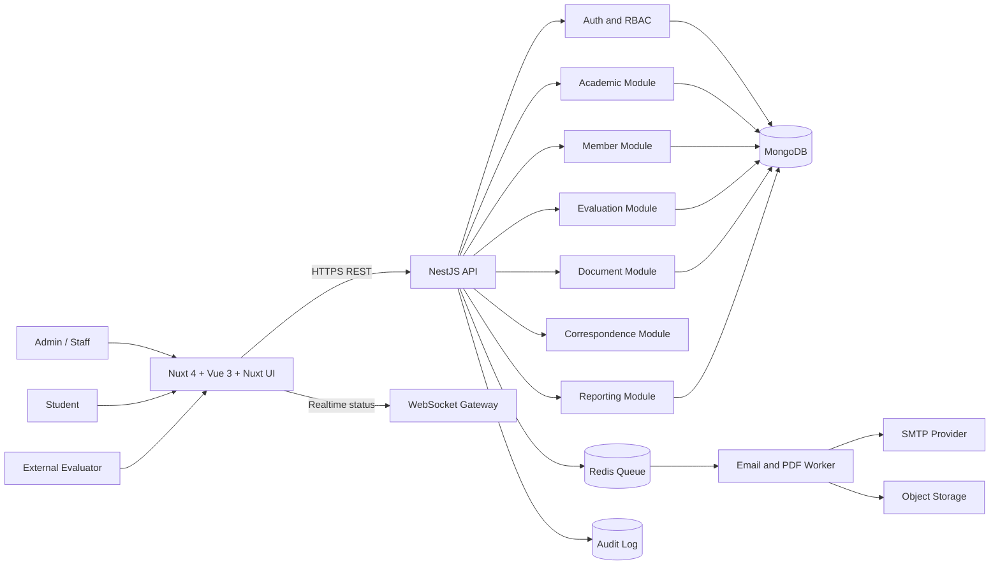
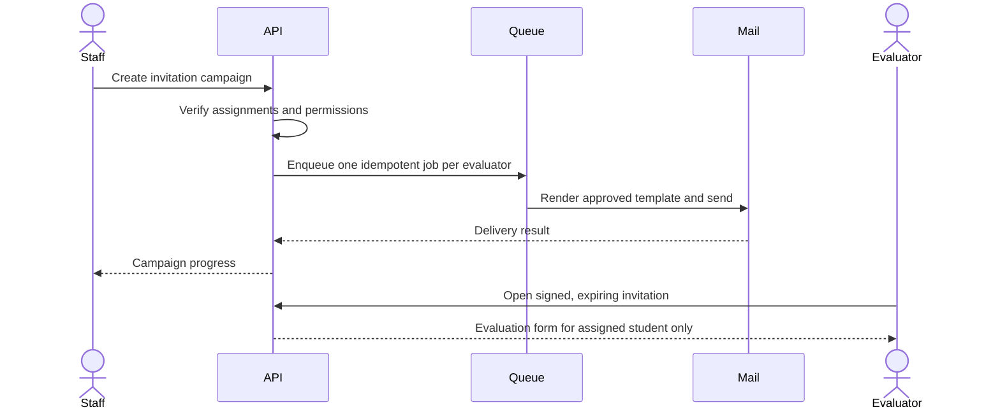
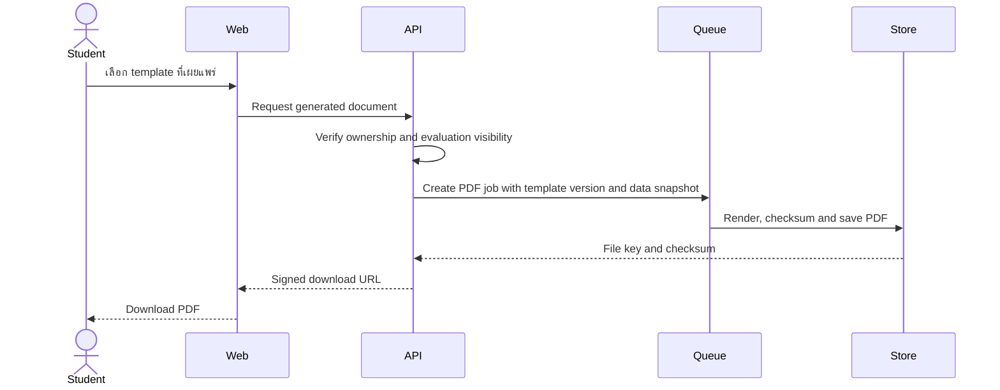

# Internship Transcript System V2

## เอกสารภาพรวมระบบและสถาปัตยกรรม

| รายการ         | รายละเอียด                                                                 |
| -------------- | -------------------------------------------------------------------------- |
| ชื่อระบบ       | Internship Transcript System V2                                            |
| องค์กรเป้าหมาย | มหาวิทยาลัยแม่ฟ้าหลวง (MFU)                                                |
| ประเภทระบบ     | Web application สำหรับบริหารการประเมินฝึกงานและสร้าง Internship Transcript |
| เอกสารต้นแบบ   | วิเคราะห์จาก `InternshipTranscript` ณ วันที่ 23 สิงหาคม 2026               |
| สถานะเอกสาร    | Draft สำหรับยืนยันขอบเขตและใช้พัฒนา V2                                     |

> เอกสารนี้แยกข้อมูลออกเป็น 2 ส่วน: **ระบบเดิมที่ตรวจพบจากโค้ดจริง (As-Is)** และ **สถาปัตยกรรม V2 (To-Be)** ซึ่งมี implementation baseline แล้ว การเชื่อมต่อ Production, business rule ที่ยังเป็น TBD, migration, UAT และ release gate ยังต้องได้รับอนุมัติจากเจ้าของระบบก่อนเปิดใช้งานจริง

## 1. บทสรุปผู้บริหาร

ระบบเดิมเป็นเว็บแอปพลิเคชันสำหรับจัดการข้อมูลนักศึกษาฝึกงาน ผู้ประเมิน สมรรถนะ แบบประเมิน การส่งอีเมล ผลประเมิน และเอกสารสรุปผล โดยมีผู้ใช้งานหลัก ได้แก่ ผู้ดูแลระบบ นักศึกษา และผู้ประเมินจากสถานประกอบการ

จากการตรวจโค้ดจริง พบว่าเทคโนโลยีหลักของระบบเดิมคือ Express/JavaScript, MongoDB/Mongoose และ Vue 2/CoreUI ไม่ใช่ NestJS/Nuxt/TypeScript ตามที่ README ระบุ ระบบมีโมดูลหลักครบสำหรับต้นแบบ แต่ยังมีความเสี่ยงด้านความปลอดภัย การควบคุมสิทธิ์ ความถูกต้องของ config การทดสอบ และความสอดคล้องของโครงสร้างข้อมูล จึงควรพัฒนา V2 ด้วยสถาปัตยกรรมแบบ modular monolith ที่แยก domain ชัดเจน มี TypeScript, validation, RBAC, audit log, queue สำหรับอีเมล และกระบวนการสร้าง PDF ที่ตรวจสอบย้อนกลับได้

## 2. หลักฐานที่ใช้วิเคราะห์

แหล่งข้อมูลหลักจากโปรเจกต์เดิม:

- `README.md` และ `render.yaml`
- `backend/package.json`, `backend/server.js`, `backend/config/*`
- routes, services, controllers และ Mongoose models ใต้ `backend/server/Project/*`
- `frontend/package.json`, Vue Router, Vuex stores และ API service
- หน้าจอใต้ `frontend/src/projects/views/*`
- Document editor ที่ใช้ Konva และ PDF generator ที่ใช้ jsPDF
- Dockerfile, Docker Compose, Nginx และ Vercel configuration

ข้อจำกัดการวิเคราะห์:

- ไม่ได้เชื่อมต่อฐานข้อมูล Production หรืออ่านข้อมูลผู้ใช้จริง
- ไม่ได้ส่งอีเมลจริงหรือเรียก external service
- README เดิมไม่สอดคล้องกับ source code จึงยึด source code เป็นหลัก
- ฟังก์ชันบางส่วนเป็น mock, template หรือโค้ดเก่าที่ยังไม่ได้ถอดออก

## 3. ภาพรวมระบบเดิม (As-Is)

### 3.1 เทคโนโลยีจริงที่ตรวจพบ

- Frontend: Vue 2.6, Vue Router 3, Vuex 3, CoreUI Pro 3, Axios, Chart.js, Konva, jsPDF
- Backend: Node.js, Express, JavaScript, Mongoose, MongoDB driver, Socket.IO, Nodemailer, Swagger UI
- Database: MongoDB
- Deployment: Frontend บน Vercel หรือ Nginx container; Backend มี Render blueprint และ Docker
- Authentication: mock login และ JWT ที่สร้างจากข้อมูลผู้ใช้จำลอง

### 3.2 โมดูลเดิม

1. **Academic**
   - จัดการ School, Program และ Course
   - รองรับชื่อและคำอธิบายหลายภาษาแบบ `[{ key, value }]`

2. **Member**
   - จัดการ Student และ Adviser
   - เชื่อม Student กับ School, Program, Course และ Evaluation
   - เชื่อม Adviser กับ Student และ Province

3. **Competencies**
   - จัดการ Soft skill, Hard skill และ Suggestion template
   - Hard skill ผูกกับ Program
   - เลือกชุดคำถาม active และรับคะแนน/ข้อเสนอแนะ

4. **Evaluation**
   - สร้างผลประเมินหนึ่งรายการต่อนักศึกษา
   - เก็บ snapshot ของชื่อคำถามและคะแนนไว้ใน evaluation
   - อัปเดต `student.evaluation` หลังบันทึกผล

5. **Correspondence**
   - จัดการ email template สำหรับ Student และ Adviser
   - แทนค่า placeholder เช่น Student Name, Student ID และ Evaluation Link
   - ส่งผ่าน SMTP/Nodemailer

6. **Documents**
   - จัดการ document template สถานะ Draft/Active/Retired หรือ Published ตาม frontend
   - เก็บ Konva JSON ใน MongoDB
   - แทรกตัวแปรข้อมูลและกราฟลงบน canvas ขนาด A4
   - สร้าง PDF ฝั่ง browser ผ่าน jsPDF

7. **Dashboard**
   - สรุปจำนวนนักศึกษา ประเมินแล้ว/ยังไม่ประเมิน
   - กรองตาม School, Program, Academic Year และช่วงเวลา
   - แสดงกราฟและตารางนักศึกษา

8. **Settings**
   - จัดการ Province, Message, Status, Group และ Verification
   - มี mock authentication endpoint สำหรับ development/testing

## 4. ผู้ใช้งานและสิทธิ์เป้าหมาย

### 4.1 System Administrator

- ตั้งค่าระบบ tenant, academic year, role และ integration
- จัดการผู้ดูแลระบบและสิทธิ์ระดับสูง
- ดู audit log และสถานะระบบ
- ไม่ควรแก้ผลประเมินโดยไม่มีเหตุผลและบันทึก audit

### 4.2 Internship Administrator / Staff

- นำเข้าและแก้ข้อมูลนักศึกษา
- จัดการผู้ประเมินและสถานประกอบการ
- ตั้งชุดสมรรถนะและรอบประเมิน
- ส่ง invitation/reminder
- ติดตามสถานะและออกรายงาน
- จัดการ document template

### 4.3 Academic Coordinator

- ดูผลใน School/Program ที่ได้รับมอบหมาย
- ตรวจความครบถ้วนของข้อมูล
- ออกรายงานระดับหลักสูตร
- ไม่สามารถแก้ system configuration นอกขอบเขต

### 4.4 Student

- เข้าสู่ระบบด้วยบัญชีมหาวิทยาลัย
- ดูข้อมูลตนเองและผลประเมินที่อนุญาตให้เผยแพร่
- ดาวน์โหลด Internship Transcript/Certificate
- แจ้งขอแก้ข้อมูลส่วนบุคคลผ่าน workflow

### 4.5 External Evaluator / Adviser

- เปิดลิงก์ประเมินแบบจำกัดสิทธิ์และมีวันหมดอายุ
- ตรวจข้อมูลนักศึกษาที่รับผิดชอบ
- ให้คะแนนและข้อเสนอแนะ
- บันทึกร่างก่อนส่ง และส่งได้หนึ่งครั้งตาม policy
- ไม่เห็นข้อมูลนักศึกษาคนอื่น

### 4.6 Auditor / Read-only

- อ่านข้อมูล รายงาน และ audit trail ตามขอบเขต
- ส่งออกหลักฐานได้ แต่แก้ข้อมูลไม่ได้

## 5. สถาปัตยกรรมเป้าหมาย V2

แนะนำ **modular monolith** ในระยะแรก เพราะ domain มีความสัมพันธ์สูง ทีมดูแลน่าจะไม่ใหญ่ และยังไม่จำเป็นต้องรับภาระ operational complexity ของ microservices

### 5.1 Frontend layer

- ใช้ Nuxt 4 บน Vue 3 และ Nuxt UI เป็น component system หลัก
- ใช้ file-based routing, layouts และ route middleware แยกประสบการณ์ตาม role
- ใช้ hybrid rendering: SSR/prerender สำหรับหน้าที่เหมาะสม และ client-only สำหรับ document canvas/Konva
- ใช้ typed API client ที่ generate จาก OpenAPI
- ใช้ route guard และ permission directive เพื่อ UX แต่ไม่ใช้ frontend เป็นด่านความปลอดภัยหลัก
- มี global error handling, loading state, empty state และ retry state
- รองรับภาษาไทย/อังกฤษและ responsive layout
- Nitro server route ทำหน้าที่เฉพาะ SSR, session/proxy หรือ thin BFF; business logic อยู่ใน NestJS API

### 5.2 API layer

- REST API ภายใต้ `/api/v2`
- แบ่ง module ตาม domain ไม่แบ่งตาม controller/service/model อย่างกระจัดกระจาย
- Validate request ด้วย DTO และ whitelist field
- ใช้ authentication guard และ authorization policy ทุก endpoint
- ตอบ error ด้วยรูปแบบมาตรฐานและ correlation ID
- เปิด OpenAPI เฉพาะ environment ที่กำหนด หรือป้องกันด้วย authentication

### 5.3 Background worker

- รับงานส่งอีเมล reminder และสร้าง PDF
- retry แบบจำกัดจำนวนครั้ง พร้อม dead-letter queue
- idempotency key ป้องกันอีเมลซ้ำหรือสร้างเอกสารซ้ำ
- บันทึกสถานะ queued, processing, completed, failed

### 5.4 Persistence layer

- MongoDB สำหรับข้อมูล domain และ template JSON
- Object storage สำหรับรูป ภาพตัวอย่าง และ PDF ที่สร้างแล้ว
- Redis สำหรับ queue, rate limit แบบ distributed และ cache ที่จำเป็น
- แยก development database กับ production database โดยเด็ดขาด

## 6. Domain boundaries

| Domain            | ความรับผิดชอบ                                      | ข้อมูลหลัก                            |
| ----------------- | -------------------------------------------------- | ------------------------------------- |
| Identity & Access | Login, session, role, permission, invitation token | users, roles, sessions                |
| Academic          | School, Program, Course, term, academic year       | schools, programs, courses, terms     |
| Internship        | Placement, company, evaluator assignment           | placements, organizations, evaluators |
| Competency        | Template, criteria, scale, version, activation     | competencySets                        |
| Evaluation        | Form instance, draft, submission, scores, comments | evaluationCycles, evaluations         |
| Correspondence    | Email template, campaign, delivery status          | emailTemplates, notifications         |
| Document          | Template editor, publish version, generation job   | documentTemplates, generatedDocuments |
| Reporting         | Dashboard, aggregate, export                       | read models/aggregations              |
| Audit             | ใครทำอะไร เมื่อใด จากที่ใด                         | auditLogs                             |

## 7. กระบวนการหลัก

### 7.1 เตรียมรอบประเมิน

1. Staff สร้าง Academic Term และกำหนดช่วงเวลา
2. นำเข้าหรือตรวจข้อมูล Student, Program และ Placement
3. ผูก External Evaluator กับ Placement/Student
4. เลือก competency set ที่ publish แล้ว
5. ระบบสร้าง evaluation instance แบบ immutable reference
6. Staff ตรวจ preview ก่อนเปิดรอบ

### 7.2 เชิญผู้ประเมิน

### 7.3 ส่งผลประเมิน

1. Evaluator เปิด invitation และยืนยันตัวตนตาม policy
2. ระบบโหลดคำถามจาก evaluation instance ไม่ใช่ template active ล่าสุด
3. Evaluator บันทึกร่างได้ตามระยะเวลา
4. ก่อน submit ระบบตรวจคำถามบังคับ ช่วงคะแนน และ consent
5. ระบบบันทึก `submittedAt`, ผู้ส่ง, IP hash และ version
6. หลัง submit ไม่แก้โดยตรง; ใช้ reopen workflow พร้อมเหตุผลและ audit
7. ระบบอัปเดต dashboard และแจ้งผู้เกี่ยวข้อง

### 7.4 สร้าง Internship Transcript

## 8. API surface ระดับสูง

| กลุ่ม          | ตัวอย่าง endpoint V2                                          | สิทธิ์                          |
| -------------- | ------------------------------------------------------------- | ------------------------------- |
| Auth           | `POST /auth/login`, `POST /auth/refresh`, `POST /auth/logout` | Public/Authenticated            |
| Academic       | `/schools`, `/programs`, `/courses`, `/terms`                 | Admin/Staff/Read-only ตาม scope |
| Members        | `/students`, `/evaluators`, `/organizations`                  | Admin/Staff                     |
| Placements     | `/placements`, `/assignments`                                 | Admin/Staff                     |
| Competencies   | `/competency-sets`, `/competency-sets/:id/publish`            | Staff                           |
| Evaluations    | `/evaluations`, `/evaluations/:id/draft`, `/submit`           | Assigned evaluator/Staff        |
| Correspondence | `/email-templates`, `/campaigns`, `/deliveries`               | Staff                           |
| Documents      | `/document-templates`, `/publish`, `/generated-documents`     | Staff/Student owner             |
| Reports        | `/reports/overview`, `/reports/programs`, `/exports`          | Staff/Coordinator               |
| Audit          | `/audit-logs`                                                 | System Admin/Auditor            |

รายละเอียด request/response ต้องกำหนดใน OpenAPI และใช้ schema เดียวกับ DTO

## 9. Environment topology

### Development

- Frontend และ backend รันบนเครื่องนักพัฒนา
- MongoDB: `mongodb://localhost:27017/internship_transcript_v2_dev`
- Redis: localhost หรือ Docker Compose
- SMTP: sandbox provider หรือ capture mail; ห้ามส่งหาผู้ใช้จริง
- ใช้ `.env.development`

### Production

- Frontend ส่งผ่าน HTTPS/CDN
- API และ worker อยู่ใน private runtime ที่ควบคุม secret ผ่าน platform secret manager
- MongoDB ใช้ remote production cluster พร้อม TLS, least privilege, backup และ network restriction
- ใช้ `.env.production`; ห้าม commit secret
- แยก database user สำหรับ app, migration และ read-only reporting

## 10. Security architecture

- ใช้ MFU SSO/OIDC หรือ Google Workspace OAuth ที่ตรวจ issuer, audience และ domain
- ใช้ short-lived access token และ secure refresh mechanism
- RBAC ร่วมกับ resource ownership เช่น student อ่านได้เฉพาะข้อมูลตนเอง
- invitation token ต้อง random, hash ก่อนเก็บ, ใช้ครั้งเดียว และมี expiry
- validate และ sanitize input ทุก endpoint
- rate limit login, invitation validation, email และ export
- CORS เป็น allowlist จาก environment ไม่ใช้ wildcard พร้อม credentials
- log แบบ structured โดยห้ามเก็บ token, password, SMTP credential หรือ MongoDB URI
- audit การเปลี่ยน role, template publish, evaluation reopen และ data export
- เข้ารหัสข้อมูลขณะส่งด้วย TLS และใช้ encryption at rest ของฐานข้อมูล/ที่เก็บไฟล์
- secret อยู่ใน secret manager ไม่อยู่ใน source, deployment manifest หรือ Git remote

## 11. Non-functional requirements

### Performance

- หน้า dashboard ใช้ pagination และ aggregation ฝั่ง server
- endpoint รายการต้องรองรับ filter, sort, projection และ cursor/page pagination
- PDF และ bulk email ทำแบบ asynchronous
- สร้าง index ตาม query pattern ที่ระบุใน `database.md`

### Reliability

- health checks แยก liveness และ readiness
- readiness ต้อง fail เมื่อ database หรือ dependency สำคัญไม่พร้อม
- graceful shutdown ต้องปิด HTTP, queue และ MongoDB connection อย่างถูกต้อง
- งาน background ต้อง retry และตรวจ idempotency

### Observability

- structured log พร้อม request ID และ user ID แบบไม่เปิดเผยข้อมูลเกินจำเป็น
- metrics: request rate, error rate, latency, DB pool, queue depth, email failure, PDF failure
- alert สำหรับ authentication anomaly, queue backlog และ backup failure

### Accessibility

- เป้าหมาย WCAG 2.2 AA
- ใช้งาน keyboard ได้ครบ, focus visible, contrast ผ่านเกณฑ์
- form error ต้องผูกกับ field และ screen reader อ่านได้
- กราฟต้องมีตารางหรือ text summary ทดแทน

### Localization

- ภาษาไทยและอังกฤษ
- เก็บข้อความแบบ object `{ th, en }` ใน V2 แทน array key/value เมื่อ schema คงที่
- date/time แสดงตาม locale แต่เก็บ UTC

## 12. ช่องว่างสำคัญจากระบบเดิม

| ระดับ    | ประเด็นที่ตรวจพบ                                                 | ผลกระทบ                                    | แนวทาง V2                                                      |
| -------- | ---------------------------------------------------------------- | ------------------------------------------ | -------------------------------------------------------------- |
| Critical | พบ credential ฐานข้อมูล Production ใน deployment manifest        | ผู้ไม่หวังดีอาจเข้าถึงฐานข้อมูล            | rotate ทันที, ลบจาก Git history, ใช้ secret manager            |
| Critical | CRUD API และ mock-login ไม่มี authorization guard ที่บังคับใช้   | อ่าน/แก้/ลบข้อมูลโดยไม่ได้รับอนุญาต        | authentication + RBAC + ownership guard                        |
| High     | README ระบุ stack ไม่ตรงกับโค้ด                                  | วางแผนและ deploy ผิด                       | สร้างเอกสารจาก source และตรวจใน CI                             |
| High     | CORS/IP configuration มีทั้ง allowlist, wildcard และค่าตัวอย่าง  | Production ใช้งานไม่ได้หรือเปิดกว้างเกิน   | environment-driven allowlist และ proxy-aware IP                |
| High     | Evaluation จำกัดซ้ำใน service แต่ไม่มี unique index              | race condition สร้างซ้ำได้                 | unique compound index ตาม cycle/student/evaluator              |
| High     | mock JWT secret มี fallback ใน source                            | token ปลอมได้หากใช้ fallback               | fail startup เมื่อไม่มี secret และปิด mock route ใน Production |
| Medium   | สถานะเอกสารใช้ Draft/Active/Retired แต่ frontend query Published | ดาวน์โหลด template ไม่พบ                   | กำหนด enum เดียวและ migration                                  |
| Medium   | ฟิลด์สะกดผิด เช่น `templete`, `sugestion`, `TOKENLANGTH`         | API และข้อมูลสับสน                         | schema/API V2 ใช้ชื่อถูก พร้อม migration mapping               |
| Medium   | PDF สร้างฝั่ง browser                                            | output ต่างกันและ audit ยาก                | worker render แบบ deterministic พร้อม checksum                 |
| Medium   | Docker ใช้ Node 14/16/20 ปะปน                                    | ความเข้ากันได้และ security patch ไม่แน่นอน | pin Node LTS เดียวทั้งระบบ                                     |
| Medium   | Backend ไม่มี test จริง และ frontend test ส่วนใหญ่เป็น template  | regression สูง                             | unit, integration, contract และ E2E test                       |
| Low      | Socket.IO มีเพียง echo event                                     | เพิ่มภาระโดยยังไม่มี business use          | ตัดออกหรือกำหนด event contract จริง                            |

## 13. Architectural decisions

1. ใช้ modular monolith ก่อน microservices
2. ใช้ TypeScript end-to-end
3. เก็บ evaluation question snapshot เพื่อรักษาประวัติ
4. version และ publish template; ห้ามแก้ published version โดยตรง
5. สร้าง PDF และส่งอีเมลผ่าน background worker
6. ใช้ MongoDB ต่อ แต่ปรับ schema, index และ transaction boundary
7. ใช้ OpenAPI เป็น contract กลาง
8. ใช้ environment แยก Development/Production และไม่ commit secret

## 14. Definition of Done ระดับระบบ

- ทุก functional requirement ใน `Tor.md` ผ่าน acceptance test
- role ทุกประเภทผ่าน authorization matrix ทั้ง positive และ negative case
- migration rehearsal ผ่านบนข้อมูลสำเนาที่ anonymize แล้ว
- ไม่มี Critical/High vulnerability ที่ยังไม่ยอมรับความเสี่ยง
- backup และ restore drill สำเร็จ
- PDF ภาษาไทย/อังกฤษแสดงผลถูกต้องและ checksum ถูกบันทึก
- email job รองรับ retry โดยไม่ส่งซ้ำ
- dashboard totals ตรงกับฐานข้อมูลจากชุดทดสอบอ้างอิง
- `.env.development` ใช้ local MongoDB และ `.env.production` ใช้ remote secret ผ่าน platform configuration
- เอกสาร System, Tech Stack, TOR, Goal, Design และ Database สอดคล้องกัน

## 15. ไฟล์เอกสารที่เกี่ยวข้อง

- `Goal.md` — วิสัยทัศน์ เป้าหมาย ตัวชี้วัด และขอบเขต
- `Tor.md` — ข้อกำหนดงานและ acceptance criteria
- `Techstack.md` — เทคโนโลยีเป้าหมายและแนวทาง migration
- `desgin.md` — UX/UI, information architecture และ design system
- `database.md` — data model, indexes, integrity, migration และ backup
