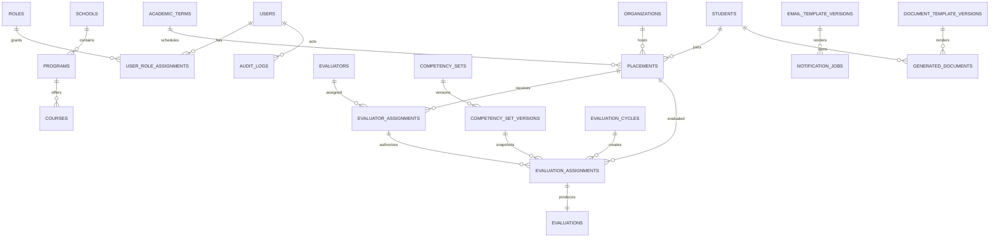

# Database Design: Internship Transcript System V2

## 1. วัตถุประสงค์

กำหนด data model สำหรับ V2 บน MongoDB โดยแก้ปัญหา schema เดิม เพิ่ม integrity, versioning, auditability, query performance และ migration traceability

## 2. ฐานข้อมูลเดิมที่ตรวจพบ

Collections จาก Mongoose models:

| Collection เดิม            | หน้าที่                 | ประเด็นที่พบ                                        |
| -------------------------- | ----------------------- | --------------------------------------------------- |
| `Academic_School`          | School/Faculty          | multilingual array; ไม่มี unique code               |
| `Academic_Program`         | Program                 | ผูก School; ไม่มี unique code                       |
| `Academic_Course`          | Course                  | ไม่มี relation กับ Program ใน schema                |
| `Students`                 | Student                 | company เป็น string; evaluation pointer เดียว       |
| `Advisors`                 | Evaluator/organization  | organization ฝังซ้ำ; student relation เดียว         |
| `Competencies_Softskill`   | Soft skill template     | active global; version ไม่ชัด                       |
| `Competencies_Hardskill`   | Hard skill template     | active ต่อ Program; year เป็น string                |
| `Competencies_Suggestions` | Suggestion template     | ชื่อและ config เหมือน competency                    |
| `Competencies_Evaluation`  | Evaluation result       | `sugestion` สะกดผิด; ไม่มี unique index             |
| `Email_Student`            | Student email template  | `templete` สะกดผิด; active global                   |
| `Email_Adviser`            | Adviser email template  | `templete` สะกดผิด; active global                   |
| `Information_Documents`    | Konva document template | content เป็น Mixed; status contract ไม่ตรง frontend |
| `Setting_Province`         | Province                | ไม่มี code/index                                    |
| `Setting_Group`            | Status group            | reference account model ไม่พบในขอบเขต               |
| `Setting_Status`           | Status                  | มี hard-coded default ObjectId                      |
| `Setting_Messages`         | API message             | มี hard-coded status ObjectId                       |
| `Setting_Verification`     | Verification setting    | มี hard-coded default ObjectId                      |

## 3. หลักการออกแบบ V2

- ใช้ collection name เป็น lowercase plural และ field เป็น camelCase
- มี stable business key เช่น `studentId`, `schoolCode`, `programCode`
- reference เมื่อ entity มี lifecycle ของตน; embed เมื่อข้อมูลเป็น snapshot/value object
- published template และ submitted evaluation immutable
- ทุก entity หลักมี `createdAt`, `updatedAt`, `createdBy`, `updatedBy`
- ใช้ `archivedAt`/`archivedBy` แทน hard delete สำหรับข้อมูลอ้างอิง
- ใช้ UTC ใน database
- multilingual text ใช้ `{ th, en }`
- ไม่มี hard-coded ObjectId ใน schema
- unique constraint บังคับที่ database ไม่พึ่ง service check
- index สร้างจาก query pattern ไม่สร้างทุก field
- เก็บ legacy ID สำหรับ migration traceability

## 4. Conceptual model



MongoDB ไม่มี foreign key enforcement แบบ relational database ดังนั้น repository/use case ต้อง validate reference และ migration/integrity job ต้องตรวจ orphan เพิ่มเติม

## 5. Core collections

### 5.1 `users`

```js
{
  _id: ObjectId,
  provider: "mfu-oidc",
  providerSubject: "opaque-subject",
  email: "user@example.edu",
  displayName: { th: "...", en: "..." },
  status: "active", // active | suspended | archived
  lastLoginAt: ISODate,
  createdAt: ISODate,
  updatedAt: ISODate,
  archivedAt: ISODate | null,
  legacy: { collection: String, id: String } | null
}
```

Indexes:

- unique `{ provider: 1, providerSubject: 1 }`
- unique partial `{ email: 1 }` เมื่อ email ไม่ null
- `{ status: 1, updatedAt: -1 }`

### 5.2 `roles` และ `userRoleAssignments`

`roles` เก็บ role definition; `userRoleAssignments` เก็บ scope เพื่อหลีกเลี่ยง array role ที่ query/audit ยาก

```js
{
  userId: ObjectId,
  roleCode: "coordinator",
  scope: {
    type: "program", // global | school | program | self
    schoolIds: [ObjectId],
    programIds: [ObjectId]
  },
  validFrom: ISODate,
  validUntil: ISODate | null,
  grantedBy: ObjectId,
  createdAt: ISODate
}
```

Unique/index:

- unique ตาม `{ userId, roleCode, scope.type, scopeKey }` โดยสร้าง normalized `scopeKey`
- `{ userId: 1, validUntil: 1 }`

### 5.3 `schools`

```js
{
  schoolCode: "IT",
  name: { th: "สำนักวิชา...", en: "School of ..." },
  description: { th: "", en: "" },
  status: "active",
  createdAt: ISODate,
  updatedAt: ISODate,
  archivedAt: null,
  legacy: { collection: "Academic_School", id: "..." }
}
```

- unique `{ schoolCode: 1 }`
- text/search index ตามภาษาต้องออกแบบจากรูปแบบค้นหาจริง; ระยะแรกใช้ normalized search fields

### 5.4 `programs`

```js
{
  programCode: "SE",
  schoolId: ObjectId,
  name: { th: "...", en: "..." },
  description: { th: "", en: "" },
  status: "active",
  createdAt: ISODate,
  updatedAt: ISODate,
  archivedAt: null,
  legacy: { collection: "Academic_Program", id: "..." }
}
```

- unique `{ schoolId: 1, programCode: 1 }`
- `{ schoolId: 1, status: 1, name.en: 1 }`

### 5.5 `courses`

```js
{
  courseCode: "240xxxx",
  programIds: [ObjectId],
  name: { th: "...", en: "..." },
  description: { th: "", en: "" },
  credits: Number | null,
  status: "active",
  createdAt: ISODate,
  updatedAt: ISODate,
  archivedAt: null
}
```

- unique `{ courseCode: 1 }`
- `{ programIds: 1, status: 1 }`

### 5.6 `academicTerms`

```js
{
  academicYear: 2026,
  semester: "1",
  code: "2026-1",
  startsAt: ISODate,
  endsAt: ISODate,
  timezone: "Asia/Bangkok",
  status: "open", // planned | open | closed | archived
  createdAt: ISODate,
  updatedAt: ISODate
}
```

- unique `{ code: 1 }`
- `{ status: 1, startsAt: -1 }`

### 5.7 `students`

```js
{
  studentId: "6631503016",
  userId: ObjectId | null,
  name: { th: "...", en: "..." },
  email: "...",
  schoolId: ObjectId,
  programId: ObjectId,
  courseId: ObjectId | null,
  admissionYear: Number | null,
  status: "active",
  createdAt: ISODate,
  updatedAt: ISODate,
  archivedAt: null,
  legacy: { collection: "Students", id: "..." }
}
```

Indexes:

- unique `{ studentId: 1 }`
- unique partial `{ userId: 1 }`
- `{ schoolId: 1, programId: 1, status: 1 }`
- normalized search fields สำหรับ name/email หากต้องค้น substring

ไม่เก็บ `evaluation` pointer เดียวใน Student เพราะนักศึกษามีหลาย term/cycle ได้

### 5.8 `organizations`

```js
{
  organizationCode: String,
  name: { th: String, en: String },
  address: {
    line1: String,
    line2: String,
    district: String,
    provinceCode: String,
    postalCode: String,
    countryCode: "TH"
  },
  contactEmail: String | null,
  status: "active",
  createdAt: ISODate,
  updatedAt: ISODate,
  archivedAt: null
}
```

- unique `{ organizationCode: 1 }`
- `{ nameNormalized: 1 }`

### 5.9 `evaluators`

```js
{
  userId: ObjectId | null,
  organizationId: ObjectId,
  email: String,
  name: { th: String, en: String },
  position: { th: String, en: String },
  phone: String | null,
  status: "active",
  createdAt: ISODate,
  updatedAt: ISODate,
  archivedAt: null,
  legacy: { collection: "Advisors", id: "..." }
}
```

- unique partial `{ organizationId: 1, email: 1 }`
- `{ email: 1, status: 1 }`

### 5.10 `placements`

```js
{
  studentId: ObjectId,
  organizationId: ObjectId,
  academicTermId: ObjectId,
  programId: ObjectId,
  positionTitle: { th: String, en: String },
  startsAt: ISODate,
  endsAt: ISODate,
  status: "active", // planned | active | completed | cancelled
  createdAt: ISODate,
  updatedAt: ISODate,
  archivedAt: null
}
```

- unique `{ studentId: 1, academicTermId: 1 }` หาก policy อนุญาต placement เดียวต่อ term
- `{ organizationId: 1, academicTermId: 1, status: 1 }`
- `{ programId: 1, academicTermId: 1 }`

### 5.11 `evaluatorAssignments`

```js
{
  placementId: ObjectId,
  evaluatorId: ObjectId,
  role: "primary", // primary | secondary
  status: "active",
  assignedAt: ISODate,
  assignedBy: ObjectId,
  revokedAt: ISODate | null
}
```

- unique partial `{ placementId: 1, evaluatorId: 1 }` เมื่อ active
- `{ evaluatorId: 1, status: 1 }`

## 6. Competency versioning

### 6.1 `competencySets`

เก็บ identity ที่คงที่ของชุดแบบประเมิน

```js
{
  code: "SE-INTERNSHIP",
  name: { th: String, en: String },
  target: {
    type: "program", // global | school | program
    schoolId: ObjectId | null,
    programId: ObjectId | null
  },
  latestVersion: 3,
  createdAt: ISODate,
  updatedAt: ISODate,
  archivedAt: null
}
```

- unique `{ code: 1 }`

### 6.2 `competencySetVersions`

```js
{
  competencySetId: ObjectId,
  version: 3,
  status: "published", // draft | published | retired
  effectiveTermIds: [ObjectId],
  scale: {
    min: 1,
    max: 5,
    labels: {
      "1": { th: "ต้องปรับปรุง", en: "Needs improvement" },
      "5": { th: "ดีเยี่ยม", en: "Excellent" }
    }
  },
  sections: [
    {
      key: "softSkills",
      title: { th: String, en: String },
      order: 1,
      criteria: [
        {
          criteriaKey: "communication",
          title: { th: String, en: String },
          question: { th: String, en: String },
          responseType: "rating",
          required: true,
          weight: 1,
          order: 1
        }
      ]
    }
  ],
  publishedAt: ISODate | null,
  publishedBy: ObjectId | null,
  createdAt: ISODate,
  updatedAt: ISODate
}
```

- unique `{ competencySetId: 1, version: 1 }`
- partial unique `{ competencySetId: 1, status: 1 }` สำหรับ draft เดียวหาก policy ต้องการ
- `{ status: 1, effectiveTermIds: 1 }`

ห้าม update published document ยกเว้น administrative metadata ที่ไม่เปลี่ยนเนื้อหา; ใช้ application guard และ audit

## 7. Evaluation workflow

### 7.1 `evaluationCycles`

```js
{
  code: "2026-1-SE",
  academicTermId: ObjectId,
  name: { th: String, en: String },
  competencySetVersionId: ObjectId,
  opensAt: ISODate,
  dueAt: ISODate,
  closesAt: ISODate,
  status: "open", // draft | scheduled | open | closed | archived
  createdBy: ObjectId,
  createdAt: ISODate,
  updatedAt: ISODate
}
```

- unique `{ code: 1 }`
- `{ academicTermId: 1, status: 1 }`

### 7.2 `evaluationAssignments`

```js
{
  cycleId: ObjectId,
  placementId: ObjectId,
  studentId: ObjectId,
  evaluatorAssignmentId: ObjectId,
  evaluatorId: ObjectId,
  competencySetVersionId: ObjectId,
  status: "invited", // pending | invited | opened | draft | submitted | overdue | cancelled
  invitationId: ObjectId | null,
  dueAt: ISODate,
  createdAt: ISODate,
  updatedAt: ISODate
}
```

- unique `{ cycleId: 1, placementId: 1, evaluatorId: 1 }`
- `{ cycleId: 1, status: 1, dueAt: 1 }`
- `{ studentId: 1, cycleId: 1 }`
- `{ evaluatorId: 1, status: 1 }`

### 7.3 `evaluationDrafts`

แยก draft เพื่อ auto-save และ TTL policy ได้โดยไม่แก้ final evaluation

```js
{
  assignmentId: ObjectId,
  answers: [{ criteriaKey: String, value: Number | String }],
  lastSavedAt: ISODate,
  version: Number,
  expiresAt: ISODate | null
}
```

- unique `{ assignmentId: 1 }`
- optional TTL `{ expiresAt: 1 }` หลัง retention policy อนุมัติ

### 7.4 `evaluations`

```js
{
  assignmentId: ObjectId,
  cycleId: ObjectId,
  studentId: ObjectId,
  evaluatorId: ObjectId,
  placementId: ObjectId,
  competencySetSnapshot: {
    competencySetId: ObjectId,
    version: Number,
    scale: Object,
    sections: Array
  },
  answers: [
    {
      sectionKey: "softSkills",
      criteriaKey: "communication",
      question: { th: String, en: String },
      score: 4,
      text: null,
      weight: 1
    }
  ],
  summary: {
    softSkillAverage: Number | null,
    hardSkillAverage: Number | null,
    weightedAverage: Number | null
  },
  status: "submitted",
  submittedAt: ISODate,
  submittedBy: { type: "evaluator", id: ObjectId },
  reopenedAt: ISODate | null,
  reopenedBy: ObjectId | null,
  reopenReason: String | null,
  revision: 1,
  createdAt: ISODate,
  updatedAt: ISODate,
  legacy: { collection: "Competencies_Evaluation", id: "..." }
}
```

- unique `{ assignmentId: 1, revision: 1 }`
- partial unique `{ assignmentId: 1, status: 1 }` สำหรับ submitted current version ตาม design ที่เลือก
- `{ studentId: 1, cycleId: 1, status: 1 }`
- `{ cycleId: 1, submittedAt: -1 }`

ใช้ snapshot เพราะ template อาจเปลี่ยนในอนาคต แต่ผลเดิมต้องอ่านได้ตรงกับคำถามเดิม

## 8. Invitation and correspondence

### 8.1 `invitations`

```js
{
  assignmentId: ObjectId,
  evaluatorId: ObjectId,
  tokenHash: String,
  tokenVersion: 1,
  expiresAt: ISODate,
  usedAt: ISODate | null,
  revokedAt: ISODate | null,
  lastOpenedAt: ISODate | null,
  createdAt: ISODate
}
```

- unique `{ tokenHash: 1 }`
- `{ assignmentId: 1, revokedAt: 1 }`
- TTL index ใช้ได้เฉพาะเมื่อยอมรับการลบอัตโนมัติ; หากต้อง audit ให้ archive แทน

ห้ามเก็บ raw token

### 8.2 `emailTemplates` และ `emailTemplateVersions`

```js
// emailTemplates
{
  code: "EVALUATOR_INVITATION",
  audience: "evaluator",
  name: { th: String, en: String },
  latestVersion: 2,
  archivedAt: null
}

// emailTemplateVersions
{
  emailTemplateId: ObjectId,
  version: 2,
  status: "published",
  locale: "th",
  subject: String,
  textBody: String,
  htmlBody: String,
  allowedPlaceholders: ["evaluator.name", "student.name", "evaluation.url"],
  publishedAt: ISODate,
  publishedBy: ObjectId
}
```

- unique `{ emailTemplateId: 1, version: 1, locale: 1 }`

### 8.3 `notificationJobs`

```js
{
  type: "evaluationInvitation",
  recipient: { userId: ObjectId | null, evaluatorId: ObjectId | null, email: String },
  templateVersionId: ObjectId,
  contextRef: { assignmentId: ObjectId },
  idempotencyKey: String,
  status: "sent", // queued | processing | sent | failed | cancelled
  attempts: Number,
  providerMessageId: String | null,
  lastErrorCode: String | null,
  scheduledAt: ISODate,
  sentAt: ISODate | null,
  createdAt: ISODate,
  updatedAt: ISODate
}
```

- unique `{ idempotencyKey: 1 }`
- `{ status: 1, scheduledAt: 1 }`
- `{ contextRef.assignmentId: 1, createdAt: -1 }`

### 8.4 `smtpSettings`

Singleton configuration for the optional database override. When `enabled` is `false` or no record exists, Worker uses SMTP values injected through the environment.

```js
{
  key: "smtp",
  enabled: Boolean,
  host: String,
  port: Number,
  secure: Boolean,
  username: String | null,
  passwordCiphertext: String | null,
  passwordIv: String | null,
  passwordAuthTag: String | null,
  from: String,
  version: Number,
  updatedBy: ObjectId,
  createdAt: ISODate,
  updatedAt: ISODate
}
```

- unique `{ key: 1 }`
- `key` accepts only `smtp`.
- Password uses AES-256-GCM with a 12-byte random IV. `SMTP_SETTINGS_ENCRYPTION_KEY` remains outside MongoDB and is injected into API/Worker through Secret Manager.
- API response and audit metadata must remove `passwordCiphertext`, `passwordIv`, `passwordAuthTag`, and plaintext password.
- Missing password fields are valid only when SMTP authentication is not required. Omitting password on update preserves existing encrypted fields.
- `version` provides optimistic concurrency. Every change records `updatedBy` and produces a mutation audit event.

### 8.5 `smtpTestDeliveries`

```js
{
  recipientEmail: String,
  status: "queued", // queued | sending | sent | failed
  configurationSource: "database", // database | environment
  configurationVersion: Number,
  createdBy: ObjectId,
  providerMessageId: String | null,
  failureCode: String | null,
  completedAt: ISODate | null,
  createdAt: ISODate,
  updatedAt: ISODate
}
```

- `{ status: 1, createdAt: -1 }`
- BullMQ payload contains only `testId`; it never contains recipient or SMTP credentials.
- Status API does not return `recipientEmail` or `providerMessageId`.
- Retention follows the owner-approved correspondence/audit policy; no automatic deletion is enabled before that policy is approved.

## 9. Document templates and files

### 9.1 `documentTemplates`

```js
{
  code: "INTERNSHIP_TRANSCRIPT",
  type: "transcript", // transcript | certificate | report
  name: { th: String, en: String },
  latestVersion: 4,
  archivedAt: null,
  createdAt: ISODate,
  updatedAt: ISODate
}
```

- unique `{ code: 1 }`

### 9.2 `documentTemplateVersions`

```js
{
  documentTemplateId: ObjectId,
  version: 4,
  status: "published",
  schemaVersion: 2,
  page: { size: "A4", orientation: "portrait", widthPx: 794, heightPx: 1123 },
  content: {
    elements: [/* validated canonical editor elements */]
  },
  placeholders: [
    { key: "student.fullName", type: "text", required: true },
    { key: "evaluation.softSkills", type: "competencyTable", required: true }
  ],
  thumbnailObjectKey: String | null,
  contentChecksum: String,
  publishedAt: ISODate | null,
  publishedBy: ObjectId | null,
  createdAt: ISODate,
  updatedAt: ISODate,
  legacy: { collection: "Information_Documents", id: "..." }
}
```

- unique `{ documentTemplateId: 1, version: 1 }`
- `{ status: 1, publishedAt: -1 }`

### 9.3 `generatedDocuments`

```js
{
  studentId: ObjectId,
  evaluationId: ObjectId,
  documentTemplateVersionId: ObjectId,
  generationJobId: String,
  status: "ready", // queued | processing | ready | failed | revoked
  dataSnapshot: Object,
  objectKey: String | null,
  mimeType: "application/pdf",
  fileSize: Number | null,
  checksumSha256: String | null,
  generatedAt: ISODate | null,
  expiresAt: ISODate | null,
  failureCode: String | null,
  createdAt: ISODate,
  createdBy: ObjectId
}
```

- unique `{ generationJobId: 1 }`
- `{ studentId: 1, createdAt: -1 }`
- `{ status: 1, createdAt: 1 }`
- `{ evaluationId: 1, documentTemplateVersionId: 1 }`

ไม่เก็บ binary PDF ใน MongoDB หากใช้ object storage ได้

## 10. Audit

### `auditLogs`

```js
{
  occurredAt: ISODate,
  actor: {
    type: "user", // user | evaluator | system
    id: ObjectId | null,
    role: String | null
  },
  action: "evaluation.reopened",
  resource: { type: "evaluation", id: ObjectId },
  result: "success", // success | denied | failed
  reason: String | null,
  requestId: String,
  source: {
    ipHash: String | null,
    userAgentClass: String | null
  },
  changes: {
    before: Object | null,
    after: Object | null,
    redactedFields: [String]
  },
  metadata: Object
}
```

Indexes:

- `{ occurredAt: -1 }`
- `{ actor.id: 1, occurredAt: -1 }`
- `{ resource.type: 1, resource.id: 1, occurredAt: -1 }`
- `{ action: 1, occurredAt: -1 }`
- `{ requestId: 1 }`

Audit API ห้าม update/delete record ปกติ Retention/archival ทำผ่าน controlled administrative process

## 11. State machines

### Evaluation assignment

```text
pending → invited → opened → draft → submitted
    └──────────────→ overdue
pending/invited/opened/draft → cancelled
submitted → reopened → draft → submitted (revision +1)
```

### Template

```text
draft → published → retired
published --create new version--> draft(version +1)
```

### Document generation

```text
queued → processing → ready
queued/processing → failed → queued(retry)
ready → revoked
```

transition ต้องทำใน use case เดียว พร้อม conditional update ป้องกัน race

## 12. Transaction and consistency

ใช้ MongoDB transaction เฉพาะ operation ที่ต้อง atomic ข้าม collection เช่น:

- submit evaluation + update assignment + audit event reference
- publish template + retire previous active version หาก policy บังคับหนึ่ง active
- commit bulk import batch metadata และ records ที่ต้อง all-or-nothing

งาน email/PDF ใช้ transactional outbox หรือสร้าง job record ใน transaction แล้ว worker poll/queue เพื่อป้องกัน DB commit สำเร็จแต่ queue หาย

## 13. Index strategy and query patterns

| Query                          | Index                                                  |
| ------------------------------ | ------------------------------------------------------ |
| Dashboard by cycle/status      | `evaluationAssignments { cycleId, status, dueAt }`     |
| Student list by school/program | `students { schoolId, programId, status }`             |
| Evaluator workload             | `evaluationAssignments { evaluatorId, status }`        |
| Student history                | `evaluations { studentId, cycleId, status }`           |
| Email queue                    | `notificationJobs { status, scheduledAt }`             |
| Document list                  | `generatedDocuments { studentId, createdAt }`          |
| Audit resource history         | `auditLogs { resource.type, resource.id, occurredAt }` |

ตรวจ index ด้วย `explain()` บน dataset ใกล้ Production ก่อนเพิ่ม index ทุกตัว เพราะ index เพิ่ม write/storage cost

## 14. Validation and integrity rules

- Student `studentId` required และ unique
- email normalize lowercase ตาม policy แต่ต้องระวัง provider-specific behavior
- Program ต้องอ้าง School ที่ active/allowed
- Placement date range ต้องอยู่ใน term หรือผ่าน exception policy
- Evaluator assignment ต้องอ้าง Placement/Evaluator ที่ไม่ archived
- Evaluation score อยู่ใน scale และ criteriaKey ต้องอยู่ใน snapshot
- Submitted evaluation ห้ามแก้ผ่าน generic update endpoint
- Published template content checksum ต้องตรง
- Unknown placeholder ทำให้ publish ไม่ผ่าน
- generated document ต้องอ้าง published template version
- archive entity ต้องตรวจ dependent active records

## 15. Data migration mapping

| Legacy                | V2                                | Transformation                          |
| --------------------- | --------------------------------- | --------------------------------------- |
| `Students.studentID`  | `students.studentId`              | trim, validate, deduplicate             |
| `Students.name[]`     | `students.name`                   | map key th/en เป็น object               |
| `Students.info.*`     | direct academic refs              | validate ObjectId mapping               |
| `Students.company`    | `organizations` + `placements`    | match/create organization ผ่าน review   |
| `Advisors`            | `evaluators` + assignments        | แยก organization และ student relation   |
| Soft/Hard/Suggestions | competency set versions           | group ตาม target/year/active state      |
| `sugestion`           | `answers` text criteria           | rename และ preserve value               |
| `templete`            | email version `htmlBody/textBody` | rename, sanitize, validate placeholders |
| document `content`    | template version content          | add `schemaVersion`, validate elements  |
| document status       | Draft/Published/Retired           | map Active ตาม approved rule            |
| legacy `_id`          | `legacy.id`                       | เก็บ mapping และ new ObjectId           |

Migration steps:

1. backup และ snapshot source
2. profile types, nulls, duplicates, orphans
3. build deterministic ID mapping
4. migrate master data
5. migrate students/organizations/placements/evaluators
6. migrate competency versions
7. migrate assignments/evaluations
8. migrate email/document templates
9. build indexes หลังแก้ duplicate
10. reconcile counts, relations และ samples
11. quarantine invalid records พร้อม reason
12. sign-off ก่อน cutover

## 16. Environment and connection

### Development

```env
MONGODB_URI=mongodb://localhost:27017/internship_transcript_v2_dev
```

### Production

```env
MONGODB_URI=<REMOTE_PRODUCTION_URI_FROM_SECRET_MANAGER>
```

ข้อกำหนด:

- ไม่ commit URI ที่มี username/password
- database name แยก dev/staging/production
- app user มีสิทธิ์เฉพาะ database/operation ที่ต้องใช้
- migration user แยกจาก runtime user
- TLS และ network allowlist/private connection ใน Production
- startup log ห้ามพิมพ์ connection string

## 17. Backup, restore and retention

- Production backup automated และ encrypted
- กำหนด retention ตาม policy ของมหาวิทยาลัยและกฎหมายที่เกี่ยวข้อง
- ทำ restore drill ตามรอบที่อนุมัติ
- backup ต้องครอบคลุม MongoDB และ object storage metadata/file
- generated document retention อาจต่างจาก raw evaluation
- invitation token/draft มี retention สั้นกว่า audit/evaluation ตาม policy
- deletion request ต้องคำนึงถึง legal hold และ record ที่องค์กรต้องเก็บ
- RPO/RTO ต้องกรอกใน TOR ก่อน Production

## 18. Security and privacy

- classify fields: public/internal/confidential/restricted
- ลด PII ใน evaluation form และ log
- hash invitation token และ IP เมื่อไม่ต้องเก็บ raw
- audit data export และ role change
- field-level encryption พิจารณาสำหรับข้อมูลที่ policy ระบุ
- Production data ห้าม clone ไป Development โดยไม่ anonymize
- rotate credential ที่เคยปรากฏใน source และลบจาก Git history
- ตรวจ MongoDB user, Atlas network access และ backup access เป็นระยะ

## 19. Database acceptance checklist

- [ ] schema/DTO/data dictionary ตรงกัน
- [ ] unique indexes ป้องกัน student/evaluation/job duplicate
- [ ] published/submitted records immutable
- [ ] query สำคัญใช้ index จาก `explain()`
- [ ] ไม่มี orphan ใน acceptance dataset
- [ ] migration rerun ได้อย่างปลอดภัยหรือหยุดด้วย checkpoint
- [ ] reconciliation report แสดง count/error/quarantine
- [ ] backup และ restore ผ่าน
- [ ] Development เชื่อม localhost เท่านั้น
- [ ] Production URI มาจาก secret managerและไม่อยู่ใน Git
- [ ] audit log ค้นตาม actor/resource/request ID ได้
- [ ] retention indexes/process ได้รับอนุมัติ
